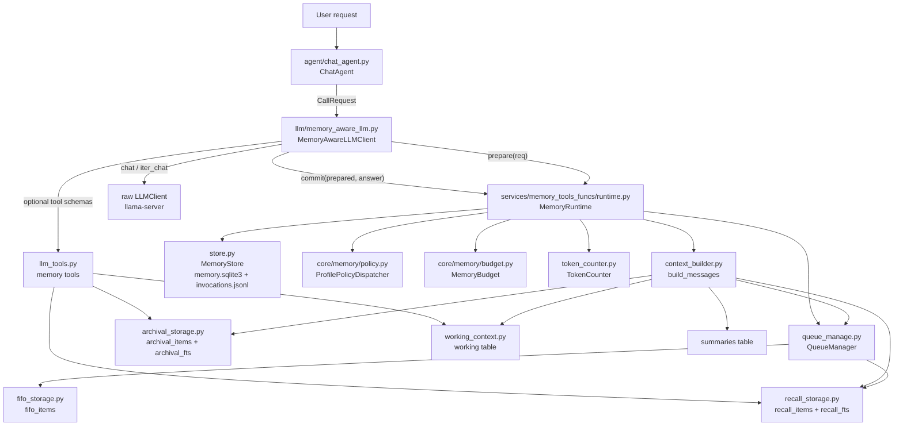
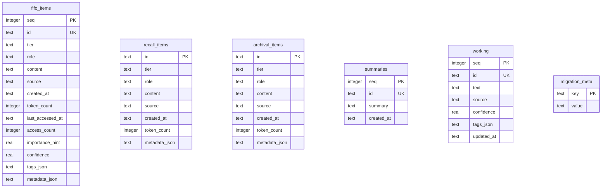
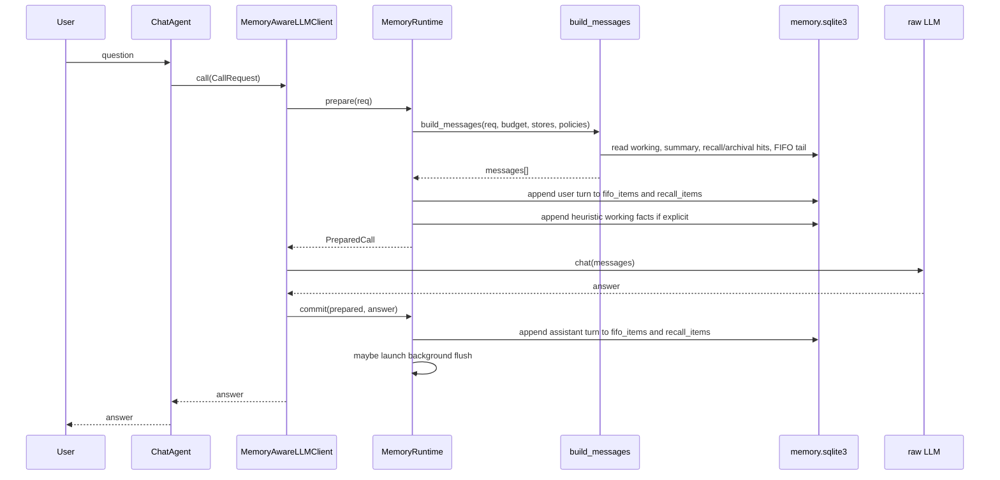
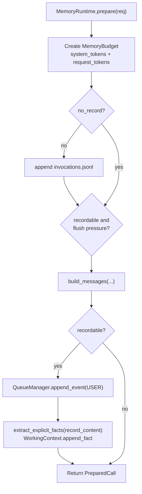
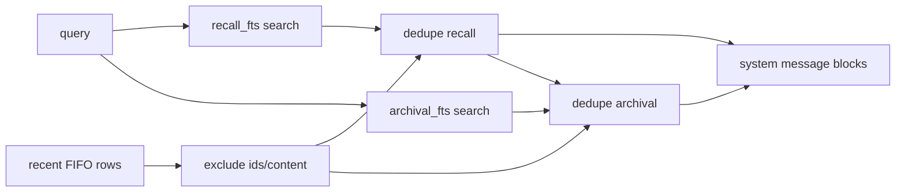
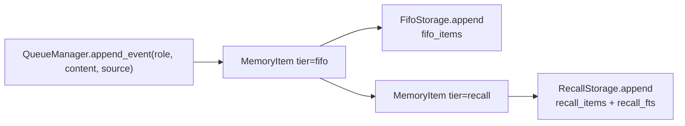
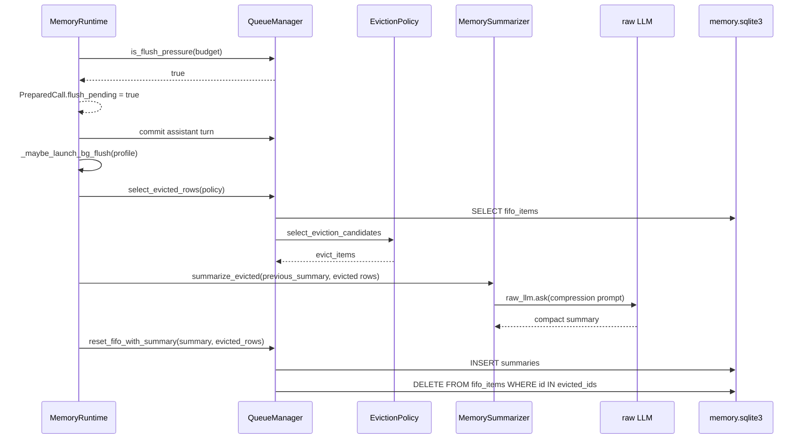
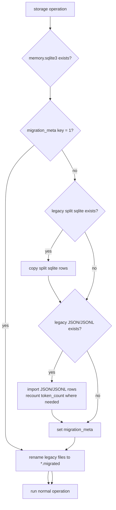

# Memory Layer Architecture

작성 기준일: 2026-05-30
대상 브랜치: `feat/59-memory`
목표 환경: 로컬 Qwen3.5 4B-9B GGUF + `llama-server`

이 문서는 현재 메모리 레이어의 실제 구현 기준 설명이다. 핵심 방향은 MemGPT식 계층을 유지하되, 작은 로컬 모델에서 불안정한 tool-call 의존을 줄이고, SQLite를 워크스페이스 단위 단일 저장소로 사용해 장기 대화의 컨텍스트 초과와 JSONL 풀스캔 문제를 피하는 것이다.

## 1. 한 줄 구조

```text
ChatAgent -> MemoryAwareLLMClient -> MemoryRuntime.prepare()
          -> build_messages() -> raw LLM
          -> MemoryRuntime.commit()
```

`MemoryRuntime`이 메모리 레이어의 중심이다. 입력 turn을 기록하고, working/summary/recall/archival/FIFO를 예산 안에서 prompt에 주입하며, 응답 후 assistant turn을 다시 기록한다.

## 2. 전체 컴포넌트



## 3. 저장소 레이아웃

현재 런타임의 단일 source of truth는 워크스페이스별 SQLite 파일 하나다.

```text
<workspace_root>/
  memory/
    memory.sqlite3       # FIFO, recall, archival, summaries, working, migration_meta
    invocations.jsonl    # 호출 감사 로그. append-only 텍스트 로그로 유지
```

아래 파일들은 런타임 저장소가 아니라 1회 마이그레이션 입력으로만 남아 있다.

```text
memory/fifo_queue.jsonl
memory/fifo.sqlite3
memory/recall_storage.jsonl
memory/recall.sqlite3
memory/summaries.jsonl
memory/working_context.json
memory/archival/items.jsonl
memory/archival/archival.sqlite3
```

마이그레이션이 완료되면 legacy 파일은 삭제하지 않고 `*.migrated`로 rename한다. 운영 중 새 데이터는 `memory.sqlite3`에만 기록된다.

## 4. SQLite 테이블

`MemoryStore.db_path`는 `memory/memory.sqlite3`를 가리킨다. 각 storage는 동일 DB에 자기 테이블만 만든다.



FTS5 virtual table은 `recall_fts`, `archival_fts` 두 개다. `recall_items`와 `archival_items`의 `content`, `source`를 검색 대상으로 삼고, 결과는 `bm25()` 기준으로 정렬한다.

## 5. Memory Tier 의미

| Tier | 저장 위치 | 목적 | prompt 주입 방식 |
|---|---|---|---|
| Working | `working` table | 항상 살아 있어야 하는 active fact | system message의 `Working Context` |
| FIFO | `fifo_items` table | 최근 raw turn history | chat messages 배열 |
| Summary | `summaries` table | FIFO에서 밀려난 turn의 압축 요약 | system message의 `Recent Conversation Summary` |
| Recall | `recall_items` + `recall_fts` | 과거 turn 검색 | system message의 `Retrieved Recall Context` |
| Archival | `archival_items` + `archival_fts` | 명시적으로 오래 보존할 durable memory | system message의 `Retrieved Archival Context` |

중요한 구분:

- FIFO는 "최근 대화를 그대로 이어붙이는 short-term queue"다.
- Recall은 "과거 raw turn을 검색해서 필요한 것만 다시 꺼내는 episodic memory"다.
- Archival은 "LLM tool 또는 명시적 경로로 저장한 durable memory"다.
- SQLite는 이 tier들의 영속 저장소다. prompt에 매번 모든 DB row를 넣는 구조가 아니다.

## 6. CallRequest Contract

메모리 경로는 `CallRequest` 기반으로만 완전히 동작한다.

```python
CallRequest(
    task_instruction="system instruction",
    user_content="actual prompt sent as current user message",
    record_content="original user utterance",
    use_history=True,
    profile="chat",
    constraints=CallConstraints(),
    enable_memory_tools=False,
)
```

핵심 필드:

| 필드 | 의미 |
|---|---|
| `task_instruction` | base system instruction 뒤에 붙는 작업 지시 |
| `user_content` | 이번 LLM 호출의 현재 user message |
| `record_content` | FIFO/recall에 기록할 원본 사용자 발화. 없으면 `user_content` 사용 |
| `use_history` | FIFO 최근 turn을 chat messages로 주입할지 여부 |
| `profile` | `chat`, `rag`, `verify`, `editor`, `autosurvey` 등 policy 선택 key |
| `enable_memory_tools` | working/recall/archival tool schema를 LLM에 노출할지 여부 |

`CallConstraints`는 prompt injection, recording, retrieval, flush trigger를 분리해서 제어한다.

| Constraint | Memory prompt | FIFO/Recall 기록 | Retrieval | Flush trigger |
|---|---|---|---|---|
| default | yes | yes | yes | yes |
| `grounded=True` | working/summary/recall/archival no | yes | no | yes |
| `json_strict=True` | no | no | no | no |
| `latency_critical=True` | no | no | no | no |
| `no_record=True` | 다른 gate가 막지 않으면 yes | no | yes | no |
| `inject_memory_context=False` | no | yes | no | yes |

## 7. Chat 실행 흐름



현재 production chat path는 `MemoryAwareLLMClient.call()` 또는 `iter_call()`을 사용한다. `ask()`/`iter_ask()`는 legacy passthrough라서 raw LLM으로 바로 전달된다. CLI나 테스트에서 raw client가 직접 들어오는 경우를 위해 fallback path는 남아 있다.

## 8. prepare() 상세 흐름



`recordable`은 `no_record`, `latency_critical`, `json_strict`가 모두 false일 때만 true다.

`prepare()`에서 user turn 기록은 `build_messages()` 이후에 수행된다. 그래야 현재 user message가 FIFO history에 중복으로 들어가지 않는다.

## 9. build_messages() 상세 흐름

```mermaid
flowchart TD
    Start["build_messages(req, budget, ...)"]
    Base["base system = common instruction + task_instruction"]
    Required["required = base system + current user_content"]
    Remaining["remaining = usable_prompt_tokens - required"]
    Gate{"memory_allowed?"}
    Working{"working allowed?"}
    AddWorking["trim working context<br/>cap working_context_tokens"]
    Summary{"summary exists and use_history?"}
    AddSummary["trim latest summary<br/>cap fifo_tokens"]
    Recent["load recent FIFO rows<br/>for dedupe"]
    Policy["profile retrieval policy"]
    Recall{"recall_limit > 0?"}
    AddRecall["RecallStorage.search(query)<br/>dedupe vs FIFO"]
    Archival{"archival_limit > 0?"}
    AddArchival["ArchivalStorage.search(query)<br/>dedupe vs FIFO + recall"]
    Pressure["optional memory pressure alert"]
    System["assemble final system message"]
    FIFO{"use_history?"}
    AddFIFO["QueueManager.as_chat_messages<br/>cap fifo_tokens"]
    User["append current user message"]

    Start --> Base --> Required --> Remaining --> Gate
    Gate --> Working
    Working -- "yes" --> AddWorking --> Summary
    Working -- "no" --> Summary
    Summary -- "yes" --> AddSummary --> Recent
    Summary -- "no" --> Recent
    Recent --> Policy --> Recall
    Recall -- "yes" --> AddRecall --> Archival
    Recall -- "no" --> Archival
    Archival -- "yes" --> AddArchival --> Pressure
    Archival -- "no" --> Pressure
    Pressure --> System --> FIFO
    FIFO -- "yes" --> AddFIFO --> User
    FIFO -- "no" --> User
```



우선순위는 다음과 같다.

1. 필수 system + 현재 user message
2. Working context
3. Latest summary
4. Recall search hits
5. Archival search hits
6. Recent FIFO chat messages
7. Current user message

각 tier는 `MemoryBudget`의 cap 안에서 `_trim_to_tokens()`로 잘린다.

## 10. Retrieval과 중복 제거

검색 query는 `record_content or user_content`다. tool output이나 history placeholder가 섞인 prompt 본문보다 원본 사용자 발화를 우선한다.



중복 제거 key:

- `id`
- normalized `content`

이로 인해 방금 FIFO history로 들어가는 turn이 system recall block에도 다시 들어가는 일을 막는다.

## 11. Recording Flow



모든 user/assistant turn은 FIFO와 recall에 동시에 들어간다. 차이는 사용 방식이다.

- FIFO는 최근 turn을 순서대로 chat messages에 넣는다.
- Recall은 전체 과거 turn 중 query에 맞는 것만 FTS로 검색한다.

## 12. Background Flush



Phase B 이후 summary도 JSONL이 아니라 `summaries` table에 들어간다. FIFO compaction은 SQLite delete라서 JSONL rewrite race가 없다.

## 13. Working Context

Working context는 record schema다.

```json
{
  "id": "uuid",
  "text": "stable fact",
  "source": "heuristic | tool | manual | legacy",
  "confidence": 1.0,
  "tags": ["explicit_user"],
  "updated_at": "2026-05-30T00:00:00+00:00"
}
```

저장은 `working` table이다. `WorkingContextManager.load()`는 record를 bullet text로 format해서 system prompt에 넣는다.

명시적 사용자 fact는 작은 모델의 tool-call 실패를 보완하기 위해 heuristic으로도 들어간다.

```text
MemoryRuntime.prepare()
  -> extract_explicit_facts(record_content)
  -> WorkingContextManager.append_fact(
         source="heuristic",
         tags=["explicit_user"],
         max_tokens=budget.working_context_tokens
     )
```

## 14. Memory Tools

`CallRequest.enable_memory_tools=True`이면 wrapper가 memory tool schema와 runner를 raw LLM 호출에 넘긴다.

| Tool | 동작 |
|---|---|
| `working_context_append` | working record 추가 |
| `working_context_replace` | matching working record 교체 |
| `recall_search` | recall FTS 검색 |
| `archival_insert` | durable archival item 저장 |
| `archival_search` | archival FTS 검색 |

스트리밍 중 tool call은 작은 로컬 모델에서 불안정하므로, `iter_call()`에서 memory tools가 켜지면 non-stream `raw.chat()` 경로로 fallback한다.

## 15. Token Budget

기본값:

| 항목 | 기본값 |
|---|---:|
| `reserve_output_tokens` | 1024 |
| `working_context_tokens` | 1200 |
| `fifo_tokens` | 1800 |
| `recall_tokens` | 1200 |
| `archival_tokens` | 1200 |
| `warning_ratio` | 0.60 |
| `flush_ratio` | 0.80 |

`TokenCounter`는 가능한 경우 raw LLM의 public `tokenize_count()`를 사용한다. 실패하면 remote tokenizer를 끄고 UTF-8 byte 기반 fallback을 사용한다. 모델 전환 시 `MemoryAwareLLMClient.refresh_model_info()`가 tokenizer remote state를 reset한다.

## 16. Profile / Policy

`ProfilePolicyDispatcher`가 `CallRequest.profile`로 retrieval/eviction policy를 고른다.

| Profile | Recall k | Archival k | 용도 |
|---|---:|---:|---|
| `chat` | 3 | 2 | 일반 대화 |
| `autosurvey` | 2 | 1 | 자동 조사 |
| `editor` | 1 | 1 | 편집 보조 |
| `verify` | 0 | 0 | 검증 |
| `rag` | 0 | 0 | strict RAG |

기본 eviction은 최근 tail을 보존하는 FIFO 정책이다. importance-aware 정책 구현도 있으나 기본 profile은 아직 보수적으로 tail keep을 사용한다.

## 17. Legacy Migration



Migration keys:

| Key | 대상 |
|---|---|
| `fifo_migrated` | `fifo.sqlite3`, `fifo_queue.jsonl` |
| `recall_migrated` | `recall.sqlite3`, `recall_storage.jsonl` |
| `archival_migrated` | `archival/archival.sqlite3`, `archival/items.jsonl` |
| `summaries_migrated` | `summaries.jsonl` |
| `working_migrated` | `working_context.json` |

Partial migration 내성은 marker로 판단한다. DB 파일이 있더라도 marker가 없으면 legacy import를 다시 시도한다.

## 18. 현재 경계

구현된 것:

- 실제 chat path의 `CallRequest` 연결
- token budget 기반 prompt assembly
- FIFO/recall/archival/summary/working의 `memory.sqlite3` 단일화
- recall/archival SQLite FTS5 검색
- recent FIFO와 retrieval 결과 dedupe
- working context record schema
- heuristic explicit fact append
- memory self-edit/search tools
- profile 기반 retrieval/eviction policy 연결
- background FIFO summary flush

남은 경계:

- Recall/archival은 keyword FTS5다. embedding semantic retrieval은 아직 없다.
- Runtime path는 `MemoryStore(reuse_connection=True)`로 하나의 SQLite connection을 재사용하고 `RLock`으로 DB 접근을 직렬화한다.
- Working context background rewrite는 prompt/manager 기반 준비는 되어 있으나 별도 worker로 완전히 독립 운영되지는 않는다.
- Summary 생성은 메인 raw LLM endpoint를 사용한다. 별도 summary 소형 모델 endpoint 분리는 아직 없다.

## 19. 검증

대표 테스트:

| 테스트 | 검증 |
|---|---|
| `tests/test_memory_unified_sqlite.py` | 단일 `memory.sqlite3` round-trip, split DB migration |
| `tests/test_memory_runtime_pr1.py` | lazy mkdir, FIFO compaction, recording gates |
| `tests/test_memory_budget.py` | token counter, budget cap, memory injection gate |
| `tests/test_recall_storage.py` | recall FTS, migration, marker behavior, dedupe |
| `tests/test_archival_storage.py` | archival FTS, migration, memory tools |
| `tests/test_working_context.py` | working record schema, legacy migration, heuristic append |

실행 명령:

```powershell
conda run -n agent python -m unittest discover -s tests
```

## 20. Phase C Connection Lifecycle

`MemoryStore` now has two connection modes:

- `reuse_connection=False`: default standalone mode. Each `connection()` context opens and closes a short-lived SQLite connection. This keeps one-off tests and utility code easy to clean up on Windows.
- `reuse_connection=True`: runtime mode. `MemoryRuntime` creates `MemoryStore(..., reuse_connection=True)`, so `fifo`, `recall`, `archival`, `summaries`, and `working` share one lazy `memory.sqlite3` connection.

Runtime connection settings:

```text
sqlite3.connect(check_same_thread=False, timeout=5.0)
PRAGMA busy_timeout=5000
PRAGMA journal_mode=WAL
PRAGMA synchronous=NORMAL
```

All shared-connection access goes through `MemoryStore.connection()`, which holds a `threading.RLock`. That means the main chat turn and the background FIFO flush cannot execute SQLite statements against the same connection at the same time. This is intentionally conservative: local single-user memory traffic is low enough that serializing DB access is simpler and safer than per-thread connection pools.

Workspace lifecycle:

- `MemoryRuntime.configure_workspace()` closes the previous store connection before constructing the next workspace store.
- `MemoryRuntime.close()` releases the runtime-owned SQLite handle.
- Legacy split DB import still uses independent short-lived connections because those files are migration inputs, not runtime storage.

Coverage:

- `tests/test_memory_connection_reuse.py::test_reuse_connection_opens_memory_sqlite_once` verifies repeated FIFO/recall/archival/summary operations reuse one main DB connection.
- `tests/test_memory_connection_reuse.py::test_reuse_connection_serializes_concurrent_writes` verifies concurrent writes are serialized without SQLite thread errors.
