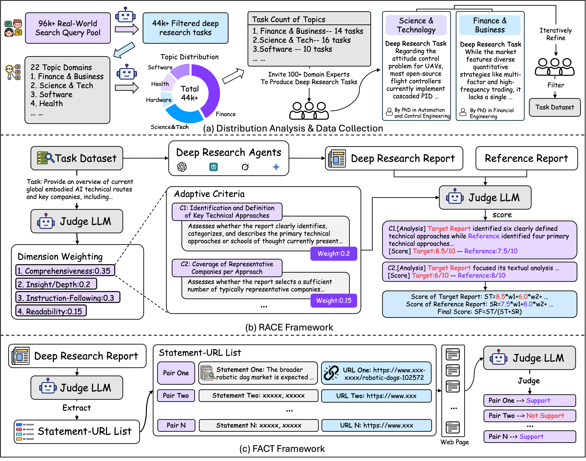

<h1 align="center">DeepResearch Bench: A Comprehensive Benchmark for Deep Research Agents</h1>

<div align="center">
<a href="https://github.com/Ayanami0730/deep_research_bench/blob/main/LICENSE"></a>
<a href="https://deepresearch-bench.github.io/"></a>
<a href="https://huggingface.co/datasets/muset-ai/DeepResearch-Bench-Dataset"></a>
<a href="https://huggingface.co/spaces/muset-ai/DeepResearch-Bench-Leaderboard"></a>
<a href="https://huggingface.co/spaces/Ayanami0730/DeepResearch-Leaderboard"></a>
<a href="https://arxiv.org/abs/2506.11763" target="_blank"></a>
<a href="https://agi-eval.cn/evaluation/detail?id=67"></a>
</div>

<h5 align="center"> If you like our project, please give us a star ⭐ on GitHub for the latest update.</h5>

# ✨ News
+ [11 May 2026] 🎯 **Official Evaluator Switched to GPT-5.5**: Following Google's announced June 17, 2026 deprecation of Gemini-2.5-Pro, we benchmarked three frontier reasoning models as candidate replacements on the human-annotated subset (50 tasks × 4 target DRAs = 200 articles), measuring each candidate's alignment with human judgments (human inter-annotator agreement baseline = **68.78%**). All three candidates exceed this baseline by 1.3–3 points; **GPT-5.5 wins on Overall, PAR, and FAS**. We are adopting it as the new RACE evaluator (with **GPT-5.4-mini** for the FACT pipeline). Scores:

  | Candidate evaluator | Overall ↑ | PAR | OPC | FAP | FAS |
  |---|---|---|---|---|---|
  | **GPT-5.5** 🥇 | **71.82** | **73.00** | 89.70 | 65.35 | **59.23** |
  | Gemini-3.1-Pro | 70.58 | 71.33 | **90.14** | 65.39 | 55.45 |
  | Claude-Opus-4-7 | 70.11 | 71.00 | 86.76 | **66.70** | 55.99 |

+ [11 May 2026] 📢 **Leaderboard Migration Plan**:

  > - **Now – 31 May 2026 (dual-acceptance window)**: We accept submissions evaluated under **both** the legacy evaluator (Gemini-2.5-Pro) **and** the new one (GPT-5.5). Results are displayed on **two separate leaderboards** so the rankings remain directly comparable within each evaluator.
  > - **By 1 June 2026 (full migration)**: For the results reported in the original DRB paper, we will re-evaluate them under GPT-5.5 and migrate them to the new leaderboard automatically. For prior community submissions evaluated under Gemini-2.5-Pro, if you would like to keep your entry on the new leaderboard, please contact us per [Submit to Leaderboard](#submit-to-leaderboard) and re-submit following the updated requirements. New submitters: follow the keys / config in [API Configuration](#api-configuration) below. After 1 June, Gemini-2.5-Pro acceptance ends and only the GPT-5.5 leaderboard is maintained going forward.
  > - **GPT-5.5 leaderboard status**: still under construction — expected to launch within a week, alongside the migrated scores.
  > - **Legacy code**: the previous Gemini-2.5-Pro / Gemini-2.5-Flash evaluation code is preserved on the [`Gemini-2.5`](https://github.com/Ayanami0730/deep_research_bench/tree/Gemini-2.5) branch.

+ [11 May 2026] 🔧 **Evaluation Pipeline v2**: In the new release we have refined the article-cleaning logic, using a chunk-based strategy to better support very long articles.

+ [6 Feb 2026] 🚀 **DeepResearch Bench II Release**: We have released **DeepResearch Bench II (DRB II)** ([homepage](https://agentresearchlab.org/benchmarks/deepresearch-bench-ii/index.html#home)｜[repo](https://github.com/imlrz/DeepResearch-Bench-II)｜[paper](https://arxiv.org/abs/2601.08536)). We welcome you to evaluate and exchange ideas. Note that DRB II, as a follow-up to DRB, has a different evaluation focus from DRB; **DRB will continue to be maintained and updated** after the release of DRB II. For more details, please refer to the [DRB II paper](https://arxiv.org/abs/2601.08536).

+ [6 Feb 2026] 📚 **New Papers from Our Lab**: We welcome you to check out the new papers from our lab ([Agent Research Lab](https://agentresearchlab.org/index.html)):
  - **Benchmarks**:
    - [DeepResearch Bench II](https://arxiv.org/abs/2601.08536): Evaluates DRA-generated reports with 9,430 fine-grained binary rubrics (information recall, analysis, presentation) derived from expert-written articles.
    - [Wiki Live Challenge](https://arxiv.org/abs/2602.01590): A live benchmark that uses Wikipedia Good Articles as expert-level references, with fine-grained criteria for writing quality and factual verifiability.
    - [WildGraphBench](https://arxiv.org/abs/2602.02053): Benchmarks GraphRAG on long, heterogeneous documents with 1,100 questions spanning single-fact QA, multi-fact QA, and section-level summarization.
  - **Agents**:
    - [A-RAG](https://arxiv.org/abs/2602.03442): An agentic RAG framework that exposes hierarchical retrieval interfaces (keyword search, semantic search, chunk read) to the model for adaptive multi-granularity retrieval.
    - [FS-Researcher](https://arxiv.org/abs/2602.01566): A file-system-based dual-agent framework (Context Builder + Report Writer) that scales deep research beyond the context window via a persistent knowledge base.

  **If you want to evaluate your deep research agent** please see the leaderboard submission requirements below and contact us at dumingxuan@mail.ustc.edu.cn and imlrz@mail.ustc.edu.cn.
+ [18 July 2025] 🎉 We have established a partnership with **AGI-Eval** platform. DeepResearch Bench is now available on [**AGI-Eval**](https://agi-eval.cn/evaluation/detail?id=67), providing a more convenient evaluation interface for researchers and practitioners to test their deep research agents.
+ [15 July 2025] ⚡️⚡️ **Major Update**: Added comprehensive evaluation of **Kimi-Researcher**, **Doubao-DeepResearch**, and **Claude-Researcher**. Upgraded evaluation infrastructure with **Gemini-2.5-Pro** for RACE and **Gemini-2.5-Flash** for FACT evaluation (since superseded — see top of News). All raw research articles and evaluation scores are now available on our [**Hugging Face Leaderboard**](https://huggingface.co/spaces/Ayanami0730/DeepResearch-Leaderboard) for comprehensive analysis and comparison.

For detailed evaluation results and comprehensive comparisons, please refer to the evaluation results table below.


## 📖 Overview

DeepResearch Bench addresses the absence of a comprehensive benchmark for systematically evaluating Deep Research Agents (DRAs). Our benchmark consists of **100 PhD-level research tasks**, each meticulously crafted by domain experts across **22 distinct fields**, including:

* 🔬 **Science & Technology**: Physics, chemistry, biology, environmental science, and engineering
* 💼 **Finance & Business**: investments, personal finance, marketing, and human resources
* 💻 **Software**: Topics related to the use of software and the internet
* 🌍 **Others**: Art & Design, Entertainment, History, Industrial, Transportation, Travel, and more


## Benchmark Construction

### Topic Distribution Analysis

To ensure DeepResearch Bench reflects real-world research demands, we analyzed **96,147 anonymized user queries** from web search-enabled LLM interactions.These queries were classified into **22 topic domains** based on the WebOrganizer taxonomy, revealing the authentic distribution of human deep research needs across different fields.

### Expert Task Collection

Guided by real-world demand distribution, we invited **PhD-level experts and senior practitioners** (5+ years experience) to design challenging research tasks within their domains. Each submission underwent rigorous manual screening for:

- **Quality**: High research standards and complexity
- **Clarity**: Clear task definitions and requirements  
- **Authenticity**: Grounded in real research scenarios
- **Challenge Level**: Testing upper limits of DRA capabilities

This process yielded **100 high-quality benchmark tasks** (50 Chinese, 50 English) that maintain the same topical balance as observed in real-world usage.


## Evaluation Framework



DeepResearch Bench introduces two complementary evaluation methodologies designed to comprehensively assess Deep Research Agents:

### 🎯 RACE (Reference-based Adaptive Criteria-driven Evaluation)

RACE evaluates **report generation quality** through a sophisticated multi-step process:

- **Dynamic Criteria Generation**: Automatically generates task-specific evaluation criteria across four key dimensions:
  - 📚 **Comprehensiveness**: Coverage breadth and depth of the research topic
  - 🔍 **Insight/Depth**: Quality of analysis and insight generation  
  - 📋 **Instruction-Following**: Adherence to specific task requirements
  - 📖 **Readability**: Clarity, organization, and presentation quality

- **Reference-Based Scoring**: Compares target reports against high-quality reference reports to ensure discriminative evaluation
- **Weighted Assessment**: Uses dynamic weights adapted to each task's specific requirements

### 🔗 FACT (Framework for Factual Abundance and Citation Trustworthiness)

FACT evaluates **information retrieval and grounding capabilities** through:

- **Statement-URL Extraction**: Automatically extracts factual claims and their cited sources from generated reports
- **Deduplication**: Removes redundant statement-URL pairs to focus on unique factual claims
- **Support Verification**: Uses web scraping and LLM judgment to verify whether cited sources actually support the claims
- **Citation Metrics**: Calculates:
  - **Citation Accuracy**: Percentage of correctly supported citations
  - **Effective Citations**: Average number of verifiably supported citations per task


## 📊 Evaluation Results

### Main Results

**View Latest Leaderboard**: Visit our [**DeepResearch Bench Leaderboard**](https://huggingface.co/spaces/muset-ai/DeepResearch-Bench-Leaderboard) for real-time updated evaluation results, detailed comparative analysis, and raw data.

### Submit to Leaderboard

If you would like to obtain an **official leaderboard entry** on DeepResearch Bench, please prepare the following materials and send them by email to:

- `dumingxuan@mail.ustc.edu.cn`
- `imlrz@mail.ustc.edu.cn`

**Required submission materials:**

1. **A temporary key with access to GPT-5.5**
   - This key is used only for verification/evaluation.
   - It should remain valid during the evaluation window.
   - Supported providers:
     - OpenAI (official)
     - OpenRouter

2. **The raw generated articles**
   - Please provide your model outputs in the same format as the benchmark raw data.
   - Reference example:
     - [`data/test_data/raw_data/claude-3-7-sonnet-latest.jsonl`](https://github.com/Ayanami0730/deep_research_bench/blob/main/data/test_data/raw_data/claude-3-7-sonnet-latest.jsonl)

3. **Reproducibility link**
   - If your model/agent is **open-source**, please provide a repository link that allows others to reproduce the results.
   - If your model/agent is **closed-source**, please provide the product page and/or API link used for reproduction and verification.

4. **Model metadata**
   - **Model name**
   - **Model/project link**
   - **Open-source license** (for open-source submissions; if closed-source, please clearly indicate that it is proprietary)

**Recommended additional files:**

- `results/race/<model_name>/race_result.txt`
- `results/fact/<model_name>/fact_result.txt`

Providing these files can help us speed up verification, but the raw generated reports and the temporary evaluation key are the most important requirements.

---

## 🛠️ Installation and Usage

### Prerequisites

- Python 3.9+
- OpenRouter or OpenAI API key (for LLM evaluation)
- Jina API key (for web scraping in FACT evaluation)

### Setup

```bash
git clone https://github.com/your-username/deep_research_bench.git
cd deep_research_bench
pip install -r requirements.txt
```

### API Configuration

Set the required API keys as environment variables:

```bash
# Pick one backend. OpenRouter is the default.
export LLM_BACKEND="openrouter"               # or "openai"

# OpenRouter (default):
export OPENROUTER_API_KEY="sk-or-v1-xxxxx"

# Or OpenAI direct:
# export LLM_BACKEND="openai"
# export OPENAI_API_KEY="sk-xxxxx"

# Set Jina API key for web scraping (FACT pipeline only)
export JINA_API_KEY="your_jina_api_key_here"
```

Default models per backend (override with `RACE_MODEL` / `FACT_MODEL` env vars):

| Backend | RACE judge (`Model`) | FACT judge (`FACT_Model`) |
|---|---|---|
| openrouter | `openai/gpt-5.5` | `openai/gpt-5.4-mini` |
| openai     | `gpt-5.5`        | `gpt-5.4-mini`        |


## Project Structure

```
deep_research_bench/
├── data/
│   ├── criteria_data/      # Evaluation criteria data
│   ├── prompt_data/        
│   │   └── query.jsonl     # ← 100 benchmark queries for your agent
│   └── test_data/          
│       ├── cleaned_data/   # Cleaned article data
│       └── raw_data/       # ← Put your model outputs here (model_name.jsonl)
├── prompt/                 # Prompt templates
├── utils/                  # Utility functions
├── deepresearch_bench_race.py  # RACE evaluation script
├── run_benchmark.sh        # ← Add your model names here, then run
└── requirements.txt        # Dependencies
```

**Quick Start Flow:**
1. Use queries from `data/prompt_data/query.jsonl` → Run your Deep Research Agent
2. Save outputs to `data/test_data/raw_data/<model_name>.jsonl`
3. Add model name to `TARGET_MODELS` in `run_benchmark.sh`
4. Run: `bash run_benchmark.sh`

## Quick Start

### 1. Prepare Your Model Data

Run your Deep Research Agent on the benchmark queries and save outputs in the required format:

**Input**: Use queries from `data/prompt_data/query.jsonl` (100 benchmark tasks)

**Output**: Save results to `data/test_data/raw_data/<model_name>.jsonl`

**Required format** (each line should contain):
```json
{
    "id": "task_id", 
    "prompt": "original_query_text", 
    "article": "generated_research_article_with_citations"
}
```

### 2. Configure Models to Evaluate

Edit `run_benchmark.sh` and add your model name:
```bash
TARGET_MODELS=("your-model-name")
```

### 3. Run Evaluation

```bash
bash run_benchmark.sh
```

Results will be saved to:
- RACE evaluation: `results/race/<model_name>/race_result.txt`
- FACT evaluation: `results/fact/<model_name>/fact_result.txt`

### Custom LLM Integration

If you're not using OpenRouter or the official OpenAI API, or want to use other LLMs for evaluation, modify the `AIClient` class in `utils/api.py` to implement your custom LLM interface.

## Acknowledgements

We would like to express our gratitude to the following contributors who helped us collect evaluation data. Since many models and agents do not provide public APIs, manual data collection was necessary, and we deeply appreciate their dedicated efforts:

**Xin Yang**, **Jie Yang**, **Yawen Li**, **Xinyu Ouyang**, **Jiaqi He**, **Gefan Zhang**, **Jinfu Liao**, **Qiuyue Chen**, **Yulin Wang**, and **Lina Wang**.

Their contributions were essential to the comprehensive evaluation presented in this benchmark.

## Citation

If you use DeepResearch Bench in your research, please cite our paper:

```bibtex
@article{du2025deepresearch,
  author    = {Mingxuan Du and Benfeng Xu and Chiwei Zhu and Xiaorui Wang and Zhendong Mao},
  title     = {DeepResearch Bench: A Comprehensive Benchmark for Deep Research Agents},
  journal   = {arXiv preprint},
  year      = {2025},
}
``` 