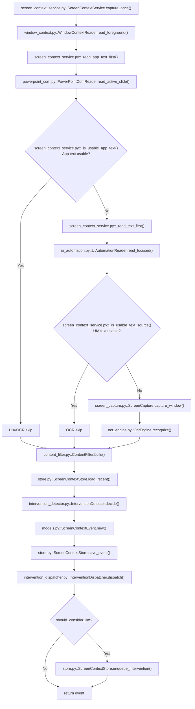
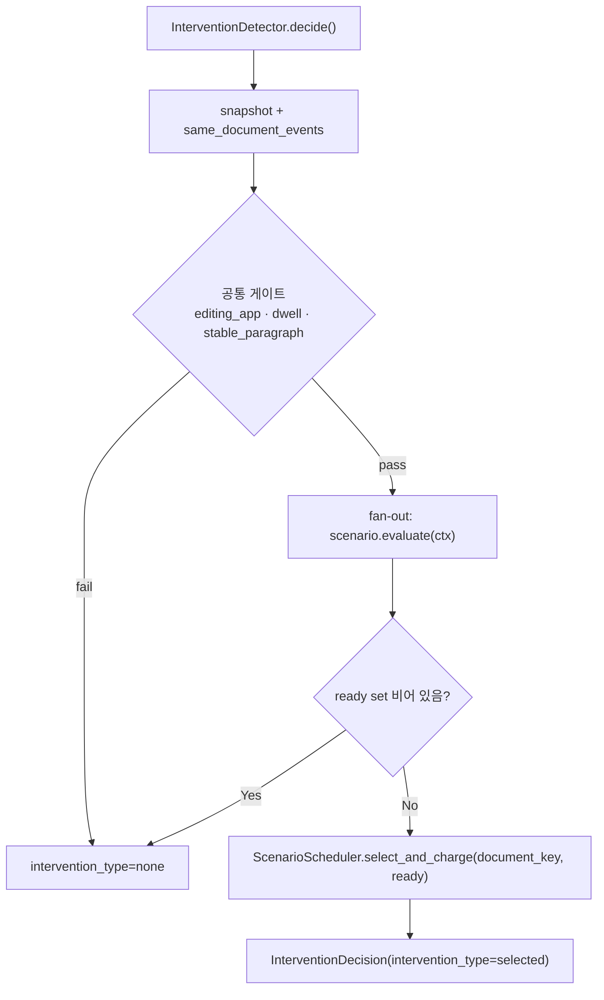
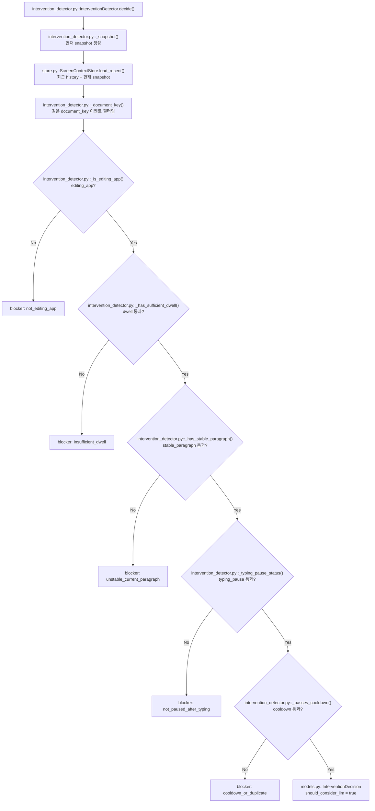

# screen_tool_funcs

Windows 화면 컨텍스트를 수집하고, 사용자가 문서/편집 앱에서 작성 중인 텍스트에 대해 LLM 개입 후보를 만들지 판단하는 모듈입니다.

이 모듈은 LLM을 직접 호출하지 않습니다. 화면/텍스트를 수집한 뒤 **공통 게이트 → 시나리오 fan-out → CFS 선택** 단계를 거쳐 통과한 후보만 intervention queue에 넣습니다.

## 실행 전제

- `main.py`에서 `--phase chat`으로 실행하거나 autosurvey 완료 후 자동 chat 진입 상태여야 합니다.
- `--no-screen-context`가 없어야 합니다.
- `ChatAgent.chat_loop(..., enable_screen_context=True)`가 screen context tool의 `start_polling`을 호출해야 합니다.
- 기본 capture 주기는 `--screen-interval 5.0`초입니다.

관련 코드:

- `main.py`
- `agent/chat_agent.py`
- `tools/screen_context_tool/screen_context_tool.py`
- `services/screen_tool_funcs/screen_context_service.py`

## 수집 파이프라인

`ScreenContextService.capture_once()`는 현재 foreground window를 읽고 아래 순서로 텍스트를 수집합니다.

1. App-specific reader
   - 현재는 PowerPoint COM reader가 active slide 텍스트를 우선 읽습니다.
2. UI Automation
   - 지원 가능한 focused control의 `TextPattern`, `ValuePattern`, selection paragraph, hover paragraph를 읽습니다.
3. OCR fallback
   - app text/UI Automation 텍스트가 충분하지 않으면 foreground window 이미지를 OCR로 읽습니다.

`ContentFilter`는 수집 결과를 `FilteredScreenContext`로 정리합니다.

- `active_app_type`: 현재 앱 유형
- `active_editor_text`: 현재 편집 영역 전체 텍스트
- `current_paragraph_text`: UIA paragraph가 있으면 해당 문단, 없으면 사용 가능한 전체 텍스트 fallback
- `current_paragraph_source`: 문단 텍스트 출처
- `changed_text`: 직전 active text가 현재 active text의 prefix인 경우 새로 붙은 suffix
- `confidence`: app text `0.95`, UIA `0.90`, OCR `0.55`, 없음 `0.0`

관련 코드:

- `window_context.py`
- `powerpoint_com.py`
- `ui_automation.py`
- `screen_capture.py`
- `ocr_engine.py`
- `content_filter.py`



<<<<<<< HEAD
=======
## 판단 구조: 공통 게이트 + 시나리오 fan-out + CFS 선택

`InterventionDetector.decide()`는 세 단계로 동작합니다.

1. **공통 게이트** — 모든 시나리오의 사전 조건. 하나라도 실패하면 즉시 `intervention_type="none"`으로 종료합니다.
2. **시나리오 fan-out** — 등록된 모든 `ScenarioType.evaluate()`를 호출합니다. ready 여부와 무관하게 모두 평가해 telemetry에 남깁니다.
3. **CFS 선택** — ready된 시나리오들 중 `ScenarioScheduler.select_and_charge()`가 단일 락 · 단일 `now`로 가장 낮은 vruntime을 고르고 vruntime을 가산합니다. 이전의 `select()`+`charge()` 분리 호출은 같은 capture 안에서 lazy decay가 두 번 적용될 수 있어 단일 메서드로 합쳐졌습니다.



>>>>>>> 68c5a7ae76466bd7622644aa892f4e582c9b2a5b
## 편집 앱 기준

`InterventionDetector`는 아래 `active_app_type`만 편집 앱으로 봅니다.

- `document`
- `presentation`
- `spreadsheet`
- `code_editor`

`ContentFilter`는 process name, window title, browser URL을 보고 app type을 추정합니다. 예를 들어 Notepad/Word/HWP/Google Docs/Hancom Docs 계열은 `document`, PowerPoint/Google Slides 계열은 `presentation`, Excel/Google Sheets 계열은 `spreadsheet`, VS Code/PyCharm 등은 `code_editor`로 분류합니다.

## 공통 게이트

세 게이트 모두 통과해야 시나리오 평가로 넘어갑니다. 하나라도 실패하면 모든 시나리오를 건너뜁니다.

### 1. editing_app

```python
active_app_type in {"document", "presentation", "spreadsheet", "code_editor"}
```

실패 시 blocker: `not_editing_app`.

### 2. dwell

같은 문서에 충분히 머물렀는지 봅니다. 문서 식별자는 `process_name|normalized_window_title` 형태의 `document_key`입니다.

판단 범위:

- `history_window`: 최근 최대 `10`개 event
- 현재 snapshot도 history에 포함해서 계산

통과 조건:

```python
history_count >= 5
dwell_ratio >= 0.5
```

실패 시 blocker: `insufficient_dwell`.

### 3. stable_paragraph

현재 문단이 LLM 개입 대상으로 쓸 만큼 충분한 길이와 신뢰도를 가지는지 봅니다.

UIA/app text 기반 통과 조건:

```python
current_paragraph_source is not empty
len(normalized_current_paragraph) >= 20
confidence >= 0.8
```

OCR fallback 통과 조건:

```python
current_paragraph_source == "ocr_same_as_full_text"
len(normalized_current_paragraph) >= 40
confidence >= 0.55
```

실패 시 blocker: `unstable_current_paragraph`.

## 시나리오

각 시나리오는 `ScenarioType` 서브클래스로, 자기 게이트 + priority + CFS 가중치(`initial_vruntime`, `vruntime_increment`)를 캡슐화합니다. payload 정제도 시나리오 객체의 hook에서 처리합니다.

| 시나리오 | initial_vruntime | vruntime_increment | 의도 |
|---|---:|---:|---|
| `idle_after_writing` | `0.0` | `1.0` | 흔한 케이스 — 한 문단 작성 후 짧은 멈춤 |
| `whole_document_review` | `-10.0` | `5.0` | 드문 케이스 — 문서 전반 리뷰 (동률 시 먼저 선택, 발사 후 강하게 throttle) |

### idle_after_writing

같은 문단에 추가 작성이 있고 직후 짧게 멈춘 상태에서 발사합니다.

게이트:

- **typing_pause** — 정규화한 `active_editor_text` 기준 최근 idle capture가 `min_idle_captures=2` 이상 연속이며, idle 직전 텍스트와 현재 텍스트 사이에 의미 있는 변화가 있어야 합니다.
   - idle 인정: 두 텍스트가 같거나, 길이 차이가 `max(3, len(current)*0.015)` 이내이고 SequenceMatcher similarity가 `idle_similarity_threshold=0.985` 이상.
   - 의미 있는 변화: 이전 텍스트 없음 + 현재가 20자 이상, 또는 prefix 관계이고 추가량이 `min_changed_chars=10` 이상, 또는 길이 차이 10자 이상, 또는 similarity < 0.98.
   - 즉시 실패: `len(current_text) < min_paragraph_chars=20`.
- **paragraph_cooldown** — 최근 `cooldown_events=5` history 안에서, 같은 `document_key` + 같은 `paragraph_fingerprint`로 `should_consider_llm=True`였던 이벤트가 있으면 실패.
   - paragraph fingerprint = 정규화한 현재 문단 앞 500자 SHA1.

점수: typing_pause `+0.5`, paragraph_cooldown `+0.3`. 둘 다 통과 시 `ready=True`. priority는 `ready and score>=0.7`이면 `high`.

### whole_document_review

같은 문서에서 충분한 양의 작성이 이어진 직후 일정 시간 멈춘 상태에서 발사합니다.

게이트:

- **sustained_writing** — 최근 `sustained_window=8` 이벤트 안에서 `added_chars >= 300` 그리고 텍스트가 늘어난 capture가 `min_active_captures=4` 이상.
- **idle_after_sustained** — 최근 텍스트와 직전 텍스트들이 `idle_similarity_threshold=0.97` 이상 유사한 capture가 `idle_after_sustained_captures=2` 이상 연속.
- **document_cooldown** — 같은 문서에서 직전 `whole_document_review` 발사로부터 `cooldown_min_seconds=300`초 이상 경과했고, 그 사이 추가된 글자가 `cooldown_min_added_chars=200` 이상.
   - elapsed 시간을 파싱 못 하면 fail-closed (cooldown 활성으로 간주).

점수: sustained `+0.4`, idle `+0.3`, cooldown `+0.2`. 셋 다 통과 시 `ready=True, priority="high"`.

## CFS 시나리오 스케줄러

`ScenarioScheduler`는 Linux CFS에서 영감을 받은 vruntime 기반 선택기입니다. `document_key` 단위로 state를 분리해 한 문서의 활동이 다른 문서의 선택을 흔들지 않습니다.

### select_and_charge

- `select_and_charge(document_key, ready_names, *, now=None)`: 단일 락 · 단일 `now` 안에서 ready 후보 중 `(vruntime, initial_vruntime, name)`이 가장 작은 시나리오를 고르고 그 vruntime에 `vruntime_increment`를 더한 뒤 `last_activity_at`을 갱신합니다.
- `select` / `charge`도 개별 호출이 가능하지만, 같은 capture 안에서 두 메서드를 잇따라 호출하면 lazy decay가 두 번 적용되므로 검파(`InterventionDetector`)는 `select_and_charge`만 사용합니다.

### lazy decay

`get_state()`가 호출될 때마다 `elapsed * decay_per_second(기본 0.05/s)` 만큼 모든 시나리오의 vruntime을 감산합니다. floor는 각 시나리오의 `initial_vruntime`.

### reset

다음 조건 중 하나라도 만족하면 해당 `document_key`의 모든 vruntime을 initial로 되돌립니다.

- `now - last_activity_at >= reset_idle_sec` (기본 3600s)
- `now - last_reset_at >= reset_interval_sec` (기본 7200s)

### persistence

- 파일: `screen_context/scheduler_state/<slug>_<sha1[:12]>.json`
- flush 스레드가 `flush_interval_sec=600`초마다 캐시 → 디스크 쓰기.
- `max_documents=50` LRU. 캐시는 `last_activity_at` 기준, 디스크 orphan은 mtime 기준으로 prune.
- `ScreenContextService.stop_polling()` 시 `flush_all()`로 종료 시점 동기화.

## 시나리오 hook을 통한 payload 분기

dispatcher는 시나리오 이름을 모릅니다. `ScenarioType`의 두 hook 메서드가 시나리오별 payload 차이를 책임집니다.

```python
class ScenarioType(ABC):
    def writing_context_overrides(self, *, filtered, base) -> dict: ...
    def tool_routing_hint_overrides(self, *, event, base, focused_sentence) -> dict: ...
```

dispatcher는 공통 base를 만든 뒤 `selected_scenario.writing_context_overrides(...)`와 `tool_routing_hint_overrides(...)`의 반환값을 base에 merge합니다 (`signals`만 부분 merge, 나머지는 덮어쓰기). 새 시나리오를 추가할 때 dispatcher를 건드릴 필요가 없습니다.

기본 구현:

| 시나리오 | `writing_context` 변경 | `tool_routing_hint` 변경 |
|---|---|---|
| `idle_after_writing` | `focus_scope="recent_writing"` | `tone="gentle_continuation"`, `preferred_action`은 research 신호 + 문단 길이로 결정 |
| `whole_document_review` | `focus_scope="full_document"`, `recent_sentences`/`full_document_excerpt`를 `review_char_limit=6000`자 head/tail 발췌로 교체 | `tone="comprehensive_review"`, `preferred_action="review_whole_document"` |

<<<<<<< HEAD
최종 통과 조건:

```python
stable_capture_count >= 2
changed_before_pause == True
```

`changed_before_pause`는 idle 구간 직전 텍스트와 현재 텍스트 사이에 의미 있는 변화가 있었는지를 뜻합니다.

의미 있는 변화 기준:

- 이전 텍스트가 없으면 현재 텍스트가 `20`자 이상일 때 변화 있음
- 현재 텍스트가 이전 텍스트로 시작하면 추가된 길이가 `10`자 이상이어야 변화 있음
- 길이 차이가 `10`자 이상이면 변화 있음
- 그 외에는 similarity가 `0.98` 미만이면 변화 있음

통과 시:

- reason: `typing_pause_satisfied`
- score: `+0.25`

실패 시:

- blocker: `not_paused_after_typing`
- 내부 reason: `current_text_too_short`, `waiting_for_idle_captures`, `no_recent_text_change_before_pause` 중 하나

### 5. cooldown

같은 문단에 대해 반복 개입하지 않게 중복을 막습니다.

통과 조건:

- 현재 paragraph fingerprint가 있어야 합니다.
- 최근 `cooldown_events=5`개 history event 안에서 `should_consider_llm=True`였던 이벤트만 봅니다.
- 그중 같은 `document_key`와 같은 paragraph fingerprint가 이미 있으면 실패합니다.

paragraph fingerprint는 현재 문단을 공백 정규화하고 소문자화한 뒤 앞 500자만 SHA1 해시한 값입니다.

통과 시:

- reason: `cooldown_dedupe_passed`
- score: `+0.10`

실패 시:

- blocker: `cooldown_or_duplicate`

## 판단 기본값

| 값 | 기본값 | 설명 |
|---|---:|---|
| `history_window` | `10` | 최근 event 확인 범위 |
| `min_history_count` | `5` | 판단에 필요한 최소 history 수 |
| `dwell_threshold` | `0.5` | 같은 문서 체류 비율 |
| `cooldown_events` | `5` | 같은 문단 중복 개입 방지 범위 |
| `min_paragraph_chars` | `20` | UIA/app paragraph 최소 길이 |
| `min_ocr_paragraph_chars` | `40` | OCR paragraph 최소 길이 |
| `min_changed_chars` | `10` | 의미 있는 텍스트 변화 최소 길이 |
| `min_idle_captures` | `2` | idle 상태로 인정할 연속 capture 수 |
| `idle_similarity_threshold` | `0.985` | idle text 유사도 기준 |

## 점수와 priority

```text
editing app active        +0.20
dwell satisfied           +0.25
current paragraph stable  +0.20
typing pause satisfied    +0.25
cooldown dedupe passed    +0.10
```

blocker가 하나도 없으면 `should_consider_llm=True`입니다.

priority:

- `high`: `should_consider_llm=True`이고 score가 `0.85` 이상
- `medium`: `should_consider_llm=True`이고 score가 `0.85` 미만
- `low`: blocker가 있음

현재 모든 gate를 통과하면 score는 `1.0`이므로 보통 `high`가 됩니다.

## 판단 흐름


=======
`ChatAgent.answer_screen_intervention()`은 `intervention_type`을 직접 읽지 않고 `writing_context` + `tool_routing_hint`만 LLM 프롬프트에 넣습니다. 시나리오 결합이 dispatcher 안에서 끊깁니다.
>>>>>>> 68c5a7ae76466bd7622644aa892f4e582c9b2a5b

## Debug CLI 로그

`main.py` 실행 시 `--screen-debug`를 추가하면 capture마다 CLI 로그가 출력됩니다.

```bash
python main.py --output-dir ./output --phase chat --screen-debug
```

주요 로그:

- `[screen_context][capture]`: event id, foreground process/title, text source, confidence, intervention_type, queued 여부
- `[screen_context][text]`: active/current/changed text 길이와 current paragraph preview
- `[screen_context][ocr]`: OCR fallback이 실제로 실행된 경우 OCR preview
- `[screen_context][decision] common.<gate>`: 공통 게이트(`editing_app`, `dwell`, `stable_paragraph`)별 `PASS` / `BLOCK`
- `[screen_context][decision] scenario.<name>`: 시나리오별 `READY` / `WAIT`와 게이트 결과 (`P`/`B`)
- `[screen_context][decision] selected=...`: CFS가 고른 시나리오와 현재 vruntimes
- `[screen_context][queue]`: intervention queue에서 소비된 event id, stale/duplicate drop 사유
- `[screen_context][assist]`: screen assist LLM 응답 생성 시작과 응답 길이

## Intervention payload

`InterventionDispatcher`는 통과한 이벤트만 downstream consumer가 사용할 payload로 변환해 queue에 저장합니다.

주요 필드:

- `intervention_type`: 선택된 시나리오 이름 (`idle_after_writing`, `whole_document_review`, ...)
- `app_context`: process, title, pid, hwnd, app type, document key
- `writing_context`: 시나리오 hook 결과가 merge된 최종 형태 — `full_text`, `current_paragraph`, `focused_sentence`, `focus_scope`, `paragraph_source`/`rect`, `changed_text`, `confidence`, (`full_document_excerpt`)
- `activity_context`: history count, same document count, dwell ratio, paragraph fingerprint, typing pause metadata, `selected_scenario`, `selected_scenario_metadata`
- `intervention_flag`: `should_consider_llm`, `intervention_type`, `selected_scenario`, priority, score, reason codes, blockers, flags
   - `flags`는 시나리오별로 분리됩니다:
     ```
     flags:
       common:    { editing_app, dwell, stable_paragraph }
       scenarios: { <scenario_name>: { ready, score, gates: { <gate>: bool } } }
       selected_scenario: <name> | None
     ```
   - 한 시나리오의 게이트 통과 여부는 `flags.scenarios.<name>.gates.<gate>`에서 보세요. 어느 시나리오가 발사됐는지는 `flags.selected_scenario`로 확인합니다. 모든 시나리오가 평가되므로 선택되지 않은 시나리오의 ready/gate 결과도 같은 자리에 남습니다.
- `tool_routing_hint`: 시나리오 hook이 채운 `tone`/`preferred_action`/`signals`
- `intervention`: detector metadata 원본 (scenarios fan-out 결과 전체 포함)

`ChatAgent.answer_screen_intervention()`은 LLM 프롬프트에 `full_text`를 그대로 넣지 않고, `recent_sentences -> focused_sentence -> changed_text -> current_paragraph 일부` 순서로 최근 작성 범위를 선택합니다.

## 저장 구조

`ScreenContextStore`는 `root/screen_context/` 아래에 capture event, intervention queue, capture log, scheduler state를 저장합니다.

```text
output_dir/
└── screen_context/
    ├── latest.json
    ├── events.jsonl              # rotation: 5MB × 5
    ├── events.jsonl.1            # (회전 시 생성)
    ├── interventions.jsonl       # rotation: 5MB × 5
    ├── intervention_queue.json   # FIFO, cap 50
    ├── latest_intervention.json
    ├── capture_logs/
    │   └── capture_<session>.jsonl  # 세션별, 최근 20세션 유지
    └── scheduler_state/
        └── <slug>_<sha1[:12]>.json  # 문서별 vruntime, LRU 50
```

주요 메서드:

```python
store.save_event(event)                       # latest.json 갱신 + events.jsonl append + rotate
store.load_latest()
store.load_recent(limit=10)                   # tail-seek (필요 시 .1 회전 파일 보강)
store.enqueue_intervention(payload)           # FIFO append + dedup + cap 50
store.load_pending_interventions(limit=None)
store.consume_pending_interventions(limit=1)
store.save_scheduler_state(document_key, payload)
store.load_scheduler_state(document_key)
```

### Rotation 정책

| 파일 | 임계치 | 보관 |
|---|---:|---:|
| `events.jsonl` | 5 MB | `.1` … `.5` |
| `interventions.jsonl` | 5 MB | `.1` … `.5` |
| `capture_logs/capture_<session>.jsonl` | 10 MB | `.1` … `.3` (세션 내) |
| `capture_logs/` 세션 파일 자체 | — | 최근 20개 (생성 시 mtime 기준 prune) |

`load_recent`는 파일을 끝에서부터 8KB 블록 단위로 backward 읽으며 newline을 카운트해 필요한 만큼만 디코드합니다. `events.jsonl`이 limit개에 미치지 못하면(예: 직후 회전) `events.jsonl.1`까지 보강합니다.

## 테스트와 진단

진단 스크립트:

```bash
python test/test_ocr_result.py --duration-sec 15 --interval-sec 3 --ocr-language ko-KR
```

주요 옵션:

| 옵션 | 설명 |
|---|---|
| `--output-dir` | screen context 결과 저장 위치 |
| `--duration-sec` | 지정 시간 후 자동 종료 |
| `--ocr-language` | OCR 언어 |
| `--ocr-scale` | OCR 입력 이미지 확대 배율 |
| `--crop-left/top/right/bottom` | window capture 후 OCR 전 crop |
| `--no-save-captures` | capture 이미지 저장 생략 |

## 새 시나리오 추가 가이드

1. `scenarios.py`에 `ScenarioType` 서브클래스 작성:
   - `name`, `priority`, `initial_vruntime`, `vruntime_increment` 클래스 변수 설정.
   - `evaluate(context)` 구현 — gate 결과를 모아 `ScenarioEvaluation` 반환.
   - 필요 시 `writing_context_overrides()` / `tool_routing_hint_overrides()` 구현으로 payload 분기.
2. `__init__.py`에 export 추가.
3. `ScreenContextService.__init__`의 `scenarios` 리스트에 인스턴스 추가.

`ScreenContextService`가 동일한 scenarios 리스트를 `ScenarioScheduler(scenarios=...)`, `InterventionDetector(scenarios=..., scheduler=...)`, `InterventionDispatcher(scenarios={...})`에 한꺼번에 주입하므로 한 곳에서만 등록하면 됩니다. dispatcher 분기, CFS 가중치 계산, scheduler 주입은 모두 자동입니다.

## 설계 원칙

1. COM/UI Automation처럼 구조화된 텍스트 소스를 OCR보다 우선 사용합니다.
2. OCR은 비용과 오류 가능성이 있으므로 fallback으로만 사용합니다.
3. 공통 게이트로 모든 시나리오에 공통된 진입 조건을 확인하고, 시나리오별 게이트는 시나리오 객체 안에서 닫힙니다.
4. ready된 시나리오가 여럿일 때는 CFS scheduler가 단 하나만 선택해 발사 빈도를 분산합니다.
5. payload 분기는 시나리오 객체 hook이 책임집니다. dispatcher와 chat agent는 시나리오 이름을 모릅니다.
6. JSONL append-only 파일은 모두 크기 기반 rotation으로 무한 성장을 막습니다. `load_recent`는 tail-seek로 파일 크기에 둔감합니다.
7. screen 수집/판단과 실제 LLM 응답 생성은 분리합니다.
