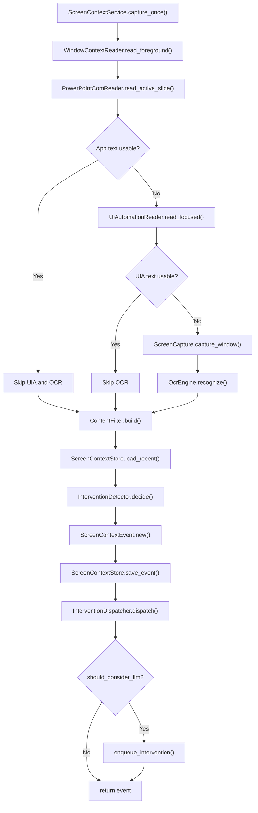
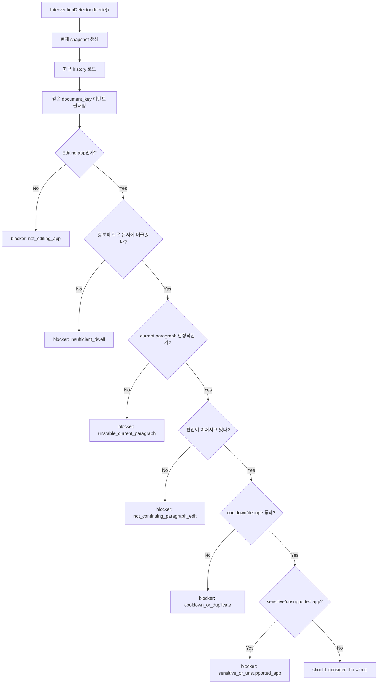

# 문서 작업 중 Agent 개입 조건

이 디렉토리의 screen context 파이프라인은 autosurvey 이후 `chat` 모드에서 screen context monitoring 이 켜져 있을 때, 사용자가 문서/편집기 계열 앱에서 작성 중인 텍스트를 주기적으로 캡처하고 조건을 만족하는 경우에만 agent 개입 후보를 큐에 넣습니다.

## 1. 실행 전제

- `main.py`에서 `--phase chat` 또는 autosurvey 완료 후 자동 chat 진입 시 `mode="auto"`로 실행되어야 합니다.
- `--no-screen-context`가 없어야 합니다.
- `ChatAgent.chat_loop(..., enable_screen_context=True)`가 `screen_context` tool의 `start_polling`을 호출해야 합니다.
- 캡처 주기는 기본 `--screen-interval 5.0`초입니다.

관련 코드:
- `main.py`
- `agent/chat_agent.py`
- `tools/screen_context_tool/screen_context_tool.py`
- `services/screen_tool_funcs/screen_context_service.py`

## 2. 캡처 및 텍스트 추출 순서

`ScreenContextService.capture_once()`는 현재 foreground window를 읽고 다음 순서로 텍스트를 수집합니다.

1. 앱 전용 reader
   - 현재는 PowerPoint (`powerpnt.exe`) active slide 텍스트를 우선 읽습니다.
2. UI Automation
   - 지원 대상 앱이면 focused control의 `TextPattern`, `ValuePattern`, selection paragraph, hover paragraph를 읽습니다.
   - 주요 대상: Notepad, Word, Excel, PowerPoint, Notepad++, Notion, HWP, VS Code, Visual Studio, PyCharm, `.txt/.md/.doc/.hwp/.ppt/.pptx` 제목을 가진 창 등.
3. OCR fallback
   - 앱/API/UI Automation 텍스트가 충분하지 않을 때 foreground window 이미지를 OCR로 읽습니다.

텍스트가 선택되면 `ContentFilter`가 다음 값을 만듭니다.

- `active_editor_text`: 현재 편집기 전체 텍스트
- `current_paragraph_text`: UIA paragraph가 있으면 해당 문단, 없으면 사용 가능한 전체 텍스트 fallback
- `changed_text`: 직전 `active_editor_text`가 현재 텍스트의 prefix인 경우 새로 붙은 suffix
- `confidence`: app text 0.95, UIA 0.90, OCR 0.55

관련 코드:
- `screen_context_service.py`
- `ui_automation.py`
- `powerpoint_com.py`
- `ocr_engine.py`
- `content_filter.py`

## 3. 개입 후보가 되는 앱 조건

`InterventionDetector`는 아래 app type만 편집 앱으로 봅니다.

- `document`
- `presentation`
- `spreadsheet`
- `code_editor`

`ContentFilter`는 프로세스명, window title, browser URL을 보고 app type을 추정합니다. 예를 들어 Notepad/Word/HWP/Google Docs/Hancom Docs 계열은 `document`, PowerPoint/Google Slides 계열은 `presentation`, Excel/Google Sheets 계열은 `spreadsheet`, VS Code/PyCharm 등은 `code_editor`로 분류됩니다.

관련 코드:
- `content_filter.py`
- `intervention_detector.py`

## 4. LLM 개입 후보 승인 조건

`InterventionDetector.decide()`는 아래 조건을 모두 통과해야 `should_consider_llm=True`로 판단합니다.

1. 편집 앱이어야 함
   - `active_app_type`이 `document`, `presentation`, `spreadsheet`, `code_editor` 중 하나여야 합니다.

2. 충분히 같은 문서에 머물러야 함
   - 기본 조건: 최근 history가 최소 5개이고, 같은 document key 비율이 0.8 이상이어야 합니다.

3. 현재 문단이 충분히 안정적이어야 함
   - UIA/app text 기반: paragraph source가 있고, 문단 길이가 20자 이상이며, confidence가 0.8 이상이어야 합니다.
   - OCR 기반: 문단 길이가 40자 이상이고, confidence가 0.55 이상이어야 합니다.

4. 사용자가 작성 후 멈춘 상태여야 함
   - 같은 문서에서 이전 캡처 대비 텍스트가 의미 있게 변한 기록이 있어야 합니다.
   - 이후 현재 텍스트와 같거나 거의 같은 내용이 기본 4회 연속 캡처되어야 합니다.
   - OCR/UIA의 공백, 줄바꿈, 극소량의 인식 흔들림은 같은 idle text로 봅니다.
   - 즉, 문장이 각 capture마다 계속 늘어나는 중이면 개입하지 않고, 작성이 멈춘 뒤 안정적으로 같은 텍스트가 관측될 때만 통과합니다.
   - 의미 있는 변화는 기본 10자 이상 증가하거나, 짧은 수정이라도 이전 텍스트와 충분히 달라진 경우로 판단합니다.

5. cooldown / duplicate 조건을 통과해야 함
   - 최근 5개 capture event 안에서 `should_consider_llm=True`였던 intervention 후보를 봅니다.
   - 그중 같은 document key와 같은 paragraph fingerprint가 이미 있으면 다시 개입하지 않습니다.
   - 즉, 같은 문단에 대해 방금 제안을 했으면 중복 제안을 막고, 문단 내용이 바뀌어 fingerprint가 달라지면 다시 통과할 수 있습니다.

6. 민감하거나 지원하지 않는 앱이 아니어야 함
   - 현재 `lockapp.exe`는 차단됩니다.

관련 코드:
- `intervention_detector.py`

## 5. 개입 payload 범위

승인된 이벤트는 `InterventionDispatcher`가 downstream payload로 변환해 intervention queue에 저장합니다.

`writing_context`에는 전체 텍스트도 보존하지만, agent에게 실제로 우선 전달되는 핵심 범위는 다음입니다.

- `recent_sentences`: 현재 문단 또는 active text의 마지막 1-2문장
- `focused_sentence`: 변경분과 가장 가까운 문장, 없으면 마지막 문장
- `changed_text`: 최근 변경 텍스트
- `full_text_chars`: 전체 텍스트 길이

`ChatAgent.answer_screen_intervention()`은 LLM 프롬프트를 만들 때 `full_text` 전체를 그대로 넣지 않고, `recent_sentences -> focused_sentence -> changed_text -> current_paragraph 일부` 순서로 최근 작성 범위를 선택합니다. 따라서 긴 문서를 계속 보고 같은 초반 문장에 대해 반복 제안하는 것을 줄이고, 마지막 1-2문장 중심으로 이어쓰기/수정/근거 보강 제안을 하도록 동작합니다.

관련 코드:
- `intervention_dispatcher.py`
- `agent/chat_agent.py`
- `core/prompts.py`

## 6. 개입 큐 처리

승인된 payload는 `ScreenContextStore`에 저장됩니다.

- latest event: `screen_context/latest.json`
- capture log: `screen_context/capture_logs/*.jsonl`
- pending intervention: `screen_context/latest_intervention.json`
- intervention log: `screen_context/interventions.jsonl`

`ChatAgent`의 background thread는 기본 2초마다 `consume_interventions`를 호출합니다. 새 intervention이 stale 하지 않고 중복 event id가 아니면 LLM 답변을 생성해 chat에 출력합니다.

추가 필터:

- 같은 event id는 한 번만 처리합니다.
- intervention captured time이 120초보다 오래되면 stale로 보고 무시합니다.
- RAG 문서가 있으면 최근 문장 기반 query로 knowledge base를 검색해 근거 제안에 활용합니다.

관련 코드:
- `store.py`
- `screen_context_tool.py`
- `agent/chat_agent.py`

## 7. Screen Debug CLI 로그

디버깅이 필요하면 `main.py` 실행 시 `--screen-debug`를 추가합니다. 기존 `--screen-debug-log`도 같은 옵션으로 계속 동작합니다.

예:

```bash
python main.py --output-dir ./output --phase chat --screen-debug
```

debug 모드에서는 screen monitoring 중 각 capture마다 CLI에 다음 로그가 출력됩니다.

- `[screen_context][capture]`: event id, foreground process/title, text source, confidence, intervention queued 여부
- `[screen_context][text]`: 추출된 active/current/changed text 길이와 현재 문단 preview
- `[screen_context][ocr]`: OCR fallback이 실제로 실행되어 텍스트를 읽은 경우 OCR preview
- `[screen_context][decision]`: 개입 판단 step별 `PASS` / `BLOCK`
- `[screen_context][queue]`: intervention queue에서 소비한 event id, stale/duplicate drop 사유
- `[screen_context][assist]`: screen assist LLM 답변 생성 시작과 생성된 답변 길이

판단 step은 다음 순서로 출력됩니다.

- `editing_app`: 현재 foreground app이 문서/편집 앱인지
- `dwell`: 같은 문서에 충분히 머물렀는지
- `stable_paragraph`: 현재 문단이 길이/confidence 기준을 만족하는지
- `typing_pause`: 작성 후 멈춘 상태인지, 즉 같은 텍스트가 `min_idle_captures`회 연속 관측되었는지
- `cooldown`: 같은 문단에 대한 중복 개입 cooldown을 통과했는지
- `supported_app`: 민감/미지원 앱이 아닌지

`ChatAgent`는 stale intervention을 기본 120초 이후 drop합니다. debug 모드에서 `[screen_context][queue] drop ... reason=stale_intervention`이 보이면, gating은 되었지만 답변 생성 thread가 이전 LLM 호출 등으로 늦어져 TTL을 넘긴 경우입니다.

# screen_tool_funcs/

**역할**: 사용자의 현재 화면, 포그라운드 창, 편집 중인 텍스트를 수집하고 LLM 개입 후보를 판단하는 screen context 서비스 모듈

---

## 📋 개요

`screen_tool_funcs/` 디렉토리는 Windows 데스크톱 환경에서 현재 사용자가 보고 있거나 편집 중인 내용을 agent가 이해할 수 있는 구조화된 context로 변환합니다.

이 모듈은 단순 OCR 유틸리티가 아니라 다음 기능을 하나의 파이프라인으로 제공합니다.

1. **포그라운드 창 식별**: 현재 활성 창의 PID, 프로세스명, 제목, 화면 좌표 수집
2. **텍스트 추출**: 앱 전용 API, UI Automation, OCR 순서로 텍스트 확보
3. **컨텍스트 정제**: active text, current paragraph, changed text, confidence 산출
4. **개입 판단**: 같은 문서에 머무는지, 문단이 안정적인지, 편집이 이어지는지 판단
5. **이벤트 저장**: latest JSON, append-only JSONL, intervention queue 관리

---

## 📁 디렉토리 구조

```
services/screen_tool_funcs/
├── __init__.py                 # 공개 API re-export
├── models.py                   # screen context 데이터 모델
├── screen_context_service.py   # 전체 수집/판단 파이프라인 오케스트레이터
├── window_context.py           # Win32 foreground window 메타데이터 수집
├── powerpoint_com.py           # PowerPoint active slide 텍스트 추출
├── ui_automation.py            # UI Automation 기반 focused/selection/hover 텍스트 추출
├── screen_capture.py           # foreground window 이미지 캡처
├── ocr_engine.py               # Windows.Media.Ocr 기반 OCR
├── content_filter.py           # 텍스트 소스 선택 및 정제
├── intervention_detector.py    # LLM 개입 후보 rule gate
├── intervention_dispatcher.py  # 개입 후보 payload 생성 및 queue 저장
└── store.py                    # screen_context 파일 저장소
```

---

## 🏗️ 핵심 컴포넌트

### 1. `ScreenContextService`

전체 파이프라인의 중심 클래스입니다. `capture_once()`가 한 번의 수집 이벤트를 만들고, `start_polling()`이 이를 주기적으로 반복합니다.

```python
service = ScreenContextService(
    root="./output",
    interval_sec=5.0,
    ocr_language="ko-KR",
    ocr_scale=2.0,
)

event = service.capture_once()
service.start_polling()
service.stop_polling()
```

주요 책임:
- window metadata 읽기
- app-specific text, UI Automation, OCR 중 적절한 텍스트 소스 선택
- `FilteredScreenContext` 생성
- `InterventionDecision` 생성
- 이벤트 저장 및 intervention queue enqueue
- polling 중 예외가 발생해도 thread가 죽지 않도록 마지막 오류를 `last_poll_error()`에 저장

### 2. 데이터 모델

`models.py`는 파이프라인 전체에서 공유되는 dataclass를 정의합니다.

| 모델 | 역할 |
|------|------|
| `BoundingBox` | 화면 좌표계 기준 사각형 |
| `WindowContext` | foreground window의 hwnd, pid, process, title, rect |
| `AppTextResult` | 앱 전용 API/COM으로 추출한 텍스트 |
| `UiAutomationResult` | UI Automation으로 추출한 focused/paragraph/hover 텍스트 |
| `OcrResult` | OCR 텍스트, line/word bbox, 이미지 크기 |
| `FilteredScreenContext` | downstream 판단에 쓰기 좋게 정제된 context |
| `InterventionDecision` | LLM 개입 후보 여부와 reason/score |
| `ScreenContextEvent` | 한 번의 polling capture 결과 전체 |

---

## 🔁 전체 코드 플로우

### `capture_once()` 실행 흐름



### 텍스트 소스 우선순위

`ScreenContextService`는 비용과 정확도를 고려해 다음 순서로 텍스트를 찾습니다.

```
1. App-specific reader
   └─ 현재는 PowerPoint COM 지원

2. UI Automation
   ├─ focused control document/value text
   ├─ selection paragraph
   └─ mouse hover paragraph

3. OCR fallback
   ├─ foreground window capture
   └─ Windows.Media.Ocr
```

이 순서는 중요한 설계 포인트입니다. 구조화된 텍스트 소스가 성공하면 OCR은 건너뛰므로 불필요한 이미지 처리 비용과 OCR 오류를 줄입니다.

---

## 🧭 세부 플로우

### 1. Window context 수집

`window_context.py`는 Win32 API를 사용합니다.

```text
GetForegroundWindow()
-> GetWindowThreadProcessId()
-> GetWindowTextW()
-> GetWindowRect()
-> OpenProcess()
-> QueryFullProcessImageNameW()
```

결과는 `WindowContext`로 반환됩니다.

```python
WindowContext(
    hwnd=...,
    pid=...,
    process_name="WINWORD.EXE",
    process_path="...",
    window_title="document.docx - Word",
    rect=BoundingBox(...),
)
```

### 2. App-specific text 추출

`powerpoint_com.py`는 `powerpnt.exe`가 foreground일 때만 동작합니다.

```text
PowerPoint.Application COM object
-> ActiveWindow
-> View.Slide
-> slide.Shapes
-> shape.TextFrame.TextRange.Text
-> NotesPage.Shapes
```

PowerPoint는 UI Automation이나 OCR보다 slide 구조를 직접 읽는 편이 정확하므로 가장 먼저 시도합니다.

### 3. UI Automation text 추출

`ui_automation.py`는 `uiautomation` 패키지를 통해 현재 focused control을 읽습니다.

수집 대상:
- focused control metadata
- TextPattern.DocumentRange
- ValuePattern.Value
- 현재 selection paragraph
- mouse hover 위치의 paragraph
- paragraph bounding rectangle

품질 판정:

| quality | 의미 |
|---------|------|
| `primary` | 앱/컨트롤 패턴상 신뢰도 높은 텍스트 |
| `usable` | 문단 또는 충분한 길이의 문서형 텍스트 |
| `weak` | 너무 짧거나 문서형 맥락이 부족한 텍스트 |
| `rejected` | 터미널 helper, 접근성 안내, 버튼/메뉴 등 부적합한 소스 |

`ScreenContextService`는 `primary`, `usable`만 OCR을 대체할 수 있는 텍스트로 봅니다.

### 4. OCR fallback

`screen_capture.py`가 foreground window 영역을 캡처하고, `ocr_engine.py`가 Windows OCR을 실행합니다.

```text
PIL.ImageGrab.grab(bbox=window.rect)
-> optional crop
-> optional scale
-> PNG bytes
-> WinRT BitmapDecoder
-> Windows.Media.Ocr.OcrEngine
-> text + lines + word bounding boxes
```

`winsdk`는 lazy import로 처리됩니다. 따라서 `screen_tool_funcs` 패키지를 import하는 것만으로 `winsdk`가 필요하지는 않고, 실제 OCR 실행 시점에만 필요합니다.

---

## 🧹 Context 정제 로직

`content_filter.py`의 `ContentFilter.build()`는 여러 텍스트 소스를 하나의 `FilteredScreenContext`로 합칩니다.

### active text 선택

```text
active_editor_text = app_text or ui_text or ocr_text
```

### current paragraph 선택

```text
1. UI Automation current paragraph가 있으면 사용
2. OCR만 있는 경우 OCR 전체 텍스트를 current paragraph로 사용
3. app text만 있는 경우 app text 전체를 current paragraph로 사용
4. 그 외에는 빈 값
```

### confidence 산정

| 소스 | confidence |
|------|------------|
| App-specific text | `0.95` |
| UI Automation text | `0.90` |
| OCR text | `0.55` |
| 없음 | `0.0` |

### changed text 계산

이전 `active_editor_text`가 현재 텍스트의 prefix이면 suffix만 변경분으로 봅니다.

```text
previous = "Hello"
current  = "Hello world"
changed_text = "world"
```

중간 삽입/삭제는 단순 suffix diff로 완전히 표현되지 않을 수 있습니다. 이 부분은 현재 구현의 의도적인 단순화입니다.

---

## 🚦 Intervention 판단 플로우

`intervention_detector.py`는 LLM을 바로 호출하지 않고, rule-based gate로 “LLM이 개입을 고려할 만한 이벤트”만 선별합니다.



### 판단 기준

| 조건 | 기본값 | 설명 |
|------|--------|------|
| `history_window` | `10` | 최근 이벤트 확인 범위 |
| `min_history_count` | `5` | 판단에 필요한 최소 history 개수 |
| `dwell_threshold` | `0.8` | 같은 문서 체류 비율 |
| `cooldown_events` | `5` | 같은 문단 중복 개입 방지 범위 |
| `min_paragraph_chars` | `20` | UIA/app paragraph 최소 길이 |
| `min_ocr_paragraph_chars` | `80` | OCR paragraph 최소 길이 |
| `min_changed_chars` | `10` | 최근 변경분으로 편집 지속 판단할 최소 길이 |

### 점수 구성

```text
editing app active         +0.20
dwell satisfied            +0.25
current paragraph stable   +0.20
paragraph edit continuing  +0.25
cooldown dedupe passed     +0.10
```

blocker가 하나도 없으면 `should_consider_llm=True`가 됩니다. priority는 score에 따라 `high` (≥0.85) / `medium` (<0.85) / `low` (blocker 있음)으로 결정됩니다. `sensitive_or_unsupported_app`이 감지되면 기존 blocker를 override하고 score를 0으로 초기화합니다.

---

## 📤 Intervention dispatch

`intervention_dispatcher.py`는 승인된 이벤트만 downstream consumer가 사용할 수 있는 payload로 변환합니다.

생성되는 주요 필드:

```python
{
    “type”: “screen_intervention”,
    “event_id”: “...”,
    “captured_at”: “...”,
    “app_context”: {
        “process”: “...”,
        “title”: “...”,
        “pid”: ...,
        “hwnd”: ...,
        “app_type”: “...”,
        “document_key”: “...”,
    },
    “app”: {
        “process”: “...”,
        “title”: “...”,
        “pid”: ...,
        “hwnd”: ...,
    },
    “writing_context”: {
        “full_text”: “...”,
        “current_paragraph”: “...”,
        “focused_sentence”: “...”,
        “paragraph_source”: “...”,
        “paragraph_rect”: {“x”: ..., “y”: ..., “width”: ..., “height”: ...},
        “changed_text”: “...”,
        “confidence”: 0.9,
    },
    “activity_context”: {
        “history_window”: ...,
        “history_count”: ...,
        “same_document_count”: ...,
        “dwell_ratio”: ...,
        “document_key”: “...”,
        “paragraph_fingerprint”: “...”,
    },
    “intervention_flag”: {
        “should_consider_llm”: True,
        “priority”: “high”,
        “score”: 1.0,
        “reason_codes”: [...],
        “blockers”: [...],
        “flags”: {
            “editing_app”: True,
            “dwell_satisfied”: True,
            “paragraph_stable”: True,
            “continuing_edit”: True,
            “cooldown_dedupe_passed”: True,
        },
    },
    “tool_routing_hint”: {
        “allowed_actions”: [“continue_writing”, “provide_supporting_material”, ...],
        “preferred_action”: “continue_writing”,
        “signals”: {
            “research_needed”: False,
            “has_recent_change”: True,
            “has_focused_sentence”: True,
        },
    },
    “intervention”: {
        “score”: 1.0,
        “priority”: “high”,
        “reason_codes”: [...],
        “metadata”: {...},
    },
}
```

`tool_routing_hint`는 문단 안에 “근거, 자료, 출처, 통계, 연구, 사례, according to, evidence, source, statistics, research” 같은 표현이 있는지 보고 `provide_supporting_material` 또는 `continue_writing`을 추천합니다. 문단이 너무 짧고 focused sentence도 없으면 `no_action`을 반환합니다.

---

## 💾 저장 구조

`store.py`는 `root/screen_context/` 아래에 이벤트와 intervention queue를 저장합니다.

```
output_dir/
└── screen_context/
    ├── latest.json              # 가장 최근 ScreenContextEvent
    ├── events.jsonl             # append-only event log
    ├── interventions.jsonl      # enqueue된 intervention payload log
    └── intervention_queue.json  # 아직 소비되지 않은 intervention queue
```

### 주요 메서드

```python
store.save_event(event)
store.load_latest()
store.load_recent(limit=10)

store.enqueue_intervention(payload)
store.load_pending_interventions(limit=10)
store.consume_pending_interventions(limit=1)
```

---

## 🔌 Tool 연동

이 서비스는 `tools/screen_context_tool/`을 통해 agent tool로 노출됩니다.

| action | 설명 |
|--------|------|
| `capture_once` | 즉시 한 번 화면 context 수집 |
| `latest` | `latest.json` 조회 |
| `recent` | 최근 이벤트 목록 조회 |
| `pending_interventions` | 대기 중인 intervention 조회 |
| `consume_interventions` | intervention queue 소비 |
| `start_polling` | background polling 시작 |
| `stop_polling` | background polling 중지 |
| `status` | polling 여부와 마지막 polling 오류 조회 |

사용 예:

```python
result = registry.get("screen_context").run(action="capture_once")
latest = registry.get("screen_context").run(action="latest")
pending = registry.get("screen_context").run(action="pending_interventions", limit=3)
```

---

## 🛠️ 의존성 및 실행 환경

이 모듈은 Windows 데스크톱 환경을 전제로 합니다.

| 기능 | 의존성 |
|------|--------|
| foreground window metadata | Win32 API via `ctypes` |
| 화면 캡처 | `Pillow` (`PIL.ImageGrab`) |
| OCR | `winsdk` (`Windows.Media.Ocr`) |
| UI Automation | `uiautomation` |
| PowerPoint COM | `pywin32` |

`requirements.txt`에는 다음 Windows 전용 패키지가 포함되어 있습니다.

```text
pywin32; platform_system == "Windows"
uiautomation; platform_system == "Windows"
winsdk==1.0.0b10; platform_system == "Windows"
```

OCR을 사용하려면 Windows에 해당 OCR language pack이 설치되어 있어야 합니다. 기본 언어는 `ko-KR`입니다.

---

## 🧪 테스트 및 디버깅

`test/test_ocr_result.py`는 `ScreenContextService`를 직접 로드해서 polling 결과를 compact JSON으로 출력하는 진단 스크립트 역할을 합니다.

예시:

```bash
python test/test_ocr_result.py --duration-sec 15 --interval-sec 3 --ocr-language ko-KR
```

유용한 옵션:

| 옵션 | 설명 |
|------|------|
| `--output-dir` | screen context 결과 저장 위치 |
| `--duration-sec` | 지정 시간 후 자동 종료 |
| `--ocr-language` | OCR 언어 |
| `--ocr-scale` | OCR 입력 이미지 확대 배율 |
| `--crop-left/top/right/bottom` | 창 캡처 후 OCR 전 crop |
| `--no-save-captures` | 캡처 이미지 저장 생략 |

`save_captures`가 켜져 있으면 다음 파일도 생성됩니다.

```
output_dir/screen_context/captures/
├── capture_*.png
└── ocr_input_*_scale_*.png
```

---

## 📐 설계 원칙

1. **정확한 소스 우선**: COM, UI Automation처럼 구조화된 텍스트 소스를 OCR보다 먼저 사용
2. **OCR은 fallback**: OCR은 비용과 오류 가능성이 있으므로 마지막 수단으로 사용
3. **LLM 호출 전 rule gate**: 모든 화면 이벤트를 LLM에 보내지 않고 개입 후보만 queue에 저장
4. **append-only 관측성**: latest와 events.jsonl을 함께 저장해 실시간 조회와 사후 분석을 모두 지원
5. **실패 격리**: polling loop의 단발성 예외가 background thread 전체를 죽이지 않도록 처리
6. **downstream 분리**: screen 수집/판단은 intervention payload만 만들고, 실제 LLM 응답 생성은 별도 consumer가 담당

---

## 🔗 의존성 관계

```
tools/screen_context_tool
    └── ScreenContextService
        ├── WindowContextReader
        ├── PowerPointComReader
        ├── UiAutomationReader
        ├── ScreenCapture
        ├── OcrEngine
        ├── ContentFilter
        ├── InterventionDetector
        ├── InterventionDispatcher
        └── ScreenContextStore
```

상위 `tools/loader.py`에서 `ScreenContextService(run_root)`를 생성하고 `ScreenContextTool`에 주입합니다.

```python
screen_context_service = ScreenContextService(run_root)

registry.register(
    ScreenContextTool(
        schema=load_schema(TOOLS_DIR / "screen_context_tool" / "tool_schema.json"),
        screen_context_service=screen_context_service,
    )
)
```

---

## ⚠️ 현재 한계

- Windows 전용 구현입니다.
- OCR 정확도는 Windows OCR language pack, 화면 배율, 창 크기, crop 설정에 영향을 받습니다.
