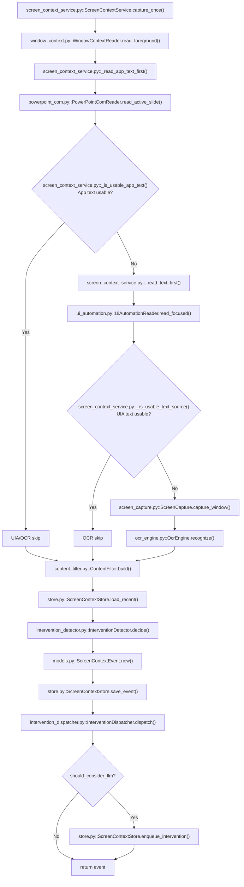
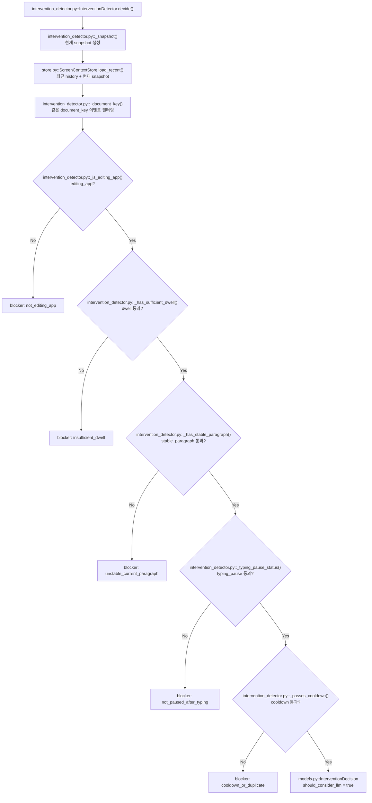

# screen_tool_funcs

Windows 화면 컨텍스트를 수집하고, 사용자가 문서/편집 앱에서 작성 중인 텍스트에 대해 LLM 개입 후보를 만들지 판단하는 모듈입니다.

이 모듈은 LLM을 직접 호출하지 않습니다. 화면/텍스트를 수집하고 rule-based gate를 통과한 이벤트만 intervention queue에 넣습니다.

## 실행 전제

- `main.py`에서 `--phase chat`으로 실행하거나 autosurvey 완료 후 자동 chat 진입 상태여야 합니다.
- `--no-screen-context`가 없어야 합니다.
- `ChatAgent.chat_loop(..., enable_screen_context=True)`가 screen context tool의 `start_polling`을 호출해야 합니다.
- 기본 capture 주기는 `--screen-interval 5.0`초입니다.

관련 코드:

- `main.py`
- `agent/chat_agent.py`
- `tools/screen_context_tool/screen_context_tool.py`
- `services/screen_tool_funcs/screen_context_service.py`

## 수집 파이프라인

`ScreenContextService.capture_once()`는 현재 foreground window를 읽고 아래 순서로 텍스트를 수집합니다.

1. App-specific reader
   - 현재는 PowerPoint COM reader가 active slide 텍스트를 우선 읽습니다.
2. UI Automation
   - 지원 가능한 focused control의 `TextPattern`, `ValuePattern`, selection paragraph, hover paragraph를 읽습니다.
3. OCR fallback
   - app text/UI Automation 텍스트가 충분하지 않으면 foreground window 이미지를 OCR로 읽습니다.

`ContentFilter`는 수집 결과를 `FilteredScreenContext`로 정리합니다.

- `active_app_type`: 현재 앱 유형
- `active_editor_text`: 현재 편집 영역 전체 텍스트
- `current_paragraph_text`: UIA paragraph가 있으면 해당 문단, 없으면 사용 가능한 전체 텍스트 fallback
- `current_paragraph_source`: 문단 텍스트 출처
- `changed_text`: 직전 active text가 현재 active text의 prefix인 경우 새로 붙은 suffix
- `confidence`: app text `0.95`, UIA `0.90`, OCR `0.55`, 없음 `0.0`

관련 코드:

- `window_context.py`
- `powerpoint_com.py`
- `ui_automation.py`
- `screen_capture.py`
- `ocr_engine.py`
- `content_filter.py`



## 편집 앱 기준

`InterventionDetector`는 아래 `active_app_type`만 편집 앱으로 봅니다.

- `document`
- `presentation`
- `spreadsheet`
- `code_editor`

`ContentFilter`는 process name, window title, browser URL을 보고 app type을 추정합니다. 예를 들어 Notepad/Word/HWP/Google Docs/Hancom Docs 계열은 `document`, PowerPoint/Google Slides 계열은 `presentation`, Excel/Google Sheets 계열은 `spreadsheet`, VS Code/PyCharm 등은 `code_editor`로 분류합니다.

## LLM 개입 후보 판단

`InterventionDetector.decide()`는 아래 조건을 모두 통과해야 `should_consider_llm=True`로 판단합니다. 하나라도 실패하면 blocker가 생기고 priority는 `low`가 됩니다.

### 1. editing_app

현재 app type이 편집 앱이어야 합니다.

```python
active_app_type in {"document", "presentation", "spreadsheet", "code_editor"}
```

통과 시:

- reason: `editing_app_active`
- score: `+0.20`

실패 시:

- blocker: `not_editing_app`

### 2. dwell

같은 문서에 충분히 머물렀는지 봅니다. 문서 식별자는 `process_name|normalized_window_title` 형태의 `document_key`입니다.

판단에 쓰는 이벤트 범위:

- `history_window`: 최근 최대 `10`개 event
- 현재 snapshot도 history에 포함해서 계산

통과 조건:

```python
history_count >= 5
dwell_ratio >= 0.5
```

`dwell_ratio`는 최근 이벤트 중 현재 `document_key`와 같은 이벤트의 비율입니다.

통과 시:

- reason: `editing_app_dwell_satisfied`
- score: `+0.25`

실패 시:

- blocker: `insufficient_dwell`

### 3. stable_paragraph

현재 문단이 LLM 개입 대상으로 쓸 만큼 충분한 길이와 신뢰도를 가지는지 봅니다. 이름은 `stable_paragraph`지만 시간적 안정성보다는 문단 품질 gate에 가깝습니다.

UIA/app text 기반 통과 조건:

```python
current_paragraph_source is not empty
len(normalized_current_paragraph) >= 20
confidence >= 0.8
```

OCR fallback 통과 조건:

```python
current_paragraph_source == "ocr_same_as_full_text"
len(normalized_current_paragraph) >= 40
confidence >= 0.55
```

통과 시:

- reason: `current_paragraph_stable`
- score: `+0.20`

실패 시:

- blocker: `unstable_current_paragraph`

### 4. typing_pause

작성 직후 사용자가 잠시 멈춘 상태인지 봅니다. 타이핑 중간에 LLM이 끼어들지 않게 하는 기준입니다.

먼저 같은 문서의 이벤트들에서 `active_editor_text`를 공백 정규화합니다.

즉시 실패 조건:

```python
len(current_text) < 20
```

그 다음 최신 이벤트부터 역순으로 보며 현재 텍스트와 같거나 거의 같은 텍스트가 몇 번 연속 관측됐는지 셉니다.

idle text로 인정하는 기준:

- 완전히 같으면 통과
- 한쪽 텍스트가 비어 있으면 실패
- 길이 차이가 `max(3, int(len(current) * 0.015))`보다 크면 실패
- 길이 차이가 허용 범위 안이면 `SequenceMatcher` similarity가 `0.985` 이상이어야 통과

최종 통과 조건:

```python
stable_capture_count >= 2
changed_before_pause == True
```

`changed_before_pause`는 idle 구간 직전 텍스트와 현재 텍스트 사이에 의미 있는 변화가 있었는지를 뜻합니다.

의미 있는 변화 기준:

- 이전 텍스트가 없으면 현재 텍스트가 `20`자 이상일 때 변화 있음
- 현재 텍스트가 이전 텍스트로 시작하면 추가된 길이가 `10`자 이상이어야 변화 있음
- 길이 차이가 `10`자 이상이면 변화 있음
- 그 외에는 similarity가 `0.98` 미만이면 변화 있음

통과 시:

- reason: `typing_pause_satisfied`
- score: `+0.25`

실패 시:

- blocker: `not_paused_after_typing`
- 내부 reason: `current_text_too_short`, `waiting_for_idle_captures`, `no_recent_text_change_before_pause` 중 하나

### 5. cooldown

같은 문단에 대해 반복 개입하지 않게 중복을 막습니다.

통과 조건:

- 현재 paragraph fingerprint가 있어야 합니다.
- 최근 `cooldown_events=5`개 history event 안에서 `should_consider_llm=True`였던 이벤트만 봅니다.
- 그중 같은 `document_key`와 같은 paragraph fingerprint가 이미 있으면 실패합니다.

paragraph fingerprint는 현재 문단을 공백 정규화하고 소문자화한 뒤 앞 500자만 SHA1 해시한 값입니다.

통과 시:

- reason: `cooldown_dedupe_passed`
- score: `+0.10`

실패 시:

- blocker: `cooldown_or_duplicate`

## 판단 기본값

| 값 | 기본값 | 설명 |
|---|---:|---|
| `history_window` | `10` | 최근 event 확인 범위 |
| `min_history_count` | `5` | 판단에 필요한 최소 history 수 |
| `dwell_threshold` | `0.5` | 같은 문서 체류 비율 |
| `cooldown_events` | `5` | 같은 문단 중복 개입 방지 범위 |
| `min_paragraph_chars` | `20` | UIA/app paragraph 최소 길이 |
| `min_ocr_paragraph_chars` | `40` | OCR paragraph 최소 길이 |
| `min_changed_chars` | `10` | 의미 있는 텍스트 변화 최소 길이 |
| `min_idle_captures` | `2` | idle 상태로 인정할 연속 capture 수 |
| `idle_similarity_threshold` | `0.985` | idle text 유사도 기준 |

## 점수와 priority

```text
editing app active        +0.20
dwell satisfied           +0.25
current paragraph stable  +0.20
typing pause satisfied    +0.25
cooldown dedupe passed    +0.10
```

blocker가 하나도 없으면 `should_consider_llm=True`입니다.

priority:

- `high`: `should_consider_llm=True`이고 score가 `0.85` 이상
- `medium`: `should_consider_llm=True`이고 score가 `0.85` 미만
- `low`: blocker가 있음

현재 모든 gate를 통과하면 score는 `1.0`이므로 보통 `high`가 됩니다.

## 판단 흐름



## Debug CLI 로그

`main.py` 실행 시 `--screen-debug`를 추가하면 capture마다 CLI 로그가 출력됩니다.

```bash
python main.py --output-dir ./output --phase chat --screen-debug
```

주요 로그:

- `[screen_context][capture]`: event id, foreground process/title, text source, confidence, intervention queued 여부
- `[screen_context][text]`: active/current/changed text 길이와 current paragraph preview
- `[screen_context][ocr]`: OCR fallback이 실제로 실행된 경우 OCR preview
- `[screen_context][decision]`: 개입 판단 step별 `PASS` / `BLOCK`
- `[screen_context][queue]`: intervention queue에서 소비된 event id, stale/duplicate drop 사유
- `[screen_context][assist]`: screen assist LLM 응답 생성 시작과 응답 길이

판단 step 출력 순서:

- `editing_app`
- `dwell`
- `stable_paragraph`
- `typing_pause`
- `cooldown`

## Intervention payload

`InterventionDispatcher`는 통과한 이벤트만 downstream consumer가 사용할 payload로 변환해 queue에 저장합니다.

주요 필드:

- `app_context`: process, title, pid, hwnd, app type, document key
- `writing_context`: full text, current paragraph, focused sentence, focus scope, paragraph source/rect, changed text, confidence
- `activity_context`: history count, same document count, dwell ratio, paragraph fingerprint, typing pause metadata
- `intervention_flag`: `should_consider_llm`, priority, score, reason codes, blockers, flags
- `tool_routing_hint`: 추천 action과 research 필요 신호
- `intervention`: detector metadata 원본

`ChatAgent.answer_screen_intervention()`은 LLM 프롬프트를 만들 때 전체 `full_text`를 그대로 넣지 않고, `recent_sentences -> focused_sentence -> changed_text -> current_paragraph 일부` 순서로 최근 작성 범위를 선택합니다.

## 저장 구조

`ScreenContextStore`는 `root/screen_context/` 아래에 capture event와 intervention queue를 저장합니다.

```text
output_dir/
└── screen_context/
    ├── latest.json
    ├── events.jsonl
    ├── interventions.jsonl
    └── intervention_queue.json
```

주요 메서드:

```python
store.save_event(event)
store.load_latest()
store.load_recent(limit=10)
store.enqueue_intervention(payload)
store.load_pending_interventions(limit=10)
store.consume_pending_interventions(limit=1)
```

## 테스트와 진단

진단 스크립트:

```bash
python test/test_ocr_result.py --duration-sec 15 --interval-sec 3 --ocr-language ko-KR
```

주요 옵션:

| 옵션 | 설명 |
|---|---|
| `--output-dir` | screen context 결과 저장 위치 |
| `--duration-sec` | 지정 시간 후 자동 종료 |
| `--ocr-language` | OCR 언어 |
| `--ocr-scale` | OCR 입력 이미지 확대 배율 |
| `--crop-left/top/right/bottom` | window capture 후 OCR 전 crop |
| `--no-save-captures` | capture 이미지 저장 생략 |

## 설계 원칙

1. COM/UI Automation처럼 구조화된 텍스트 소스를 OCR보다 우선 사용합니다.
2. OCR은 비용과 오류 가능성이 있으므로 fallback으로만 사용합니다.
3. 모든 화면 이벤트를 LLM에 보내지 않고, rule gate를 통과한 후보만 queue에 저장합니다.
4. latest JSON과 append-only JSONL을 함께 저장해 실시간 조회와 사후 분석을 모두 지원합니다.
5. polling loop의 예외는 background thread 전체를 죽이지 않도록 격리합니다.
6. screen 수집/판단과 실제 LLM 응답 생성은 분리합니다.
